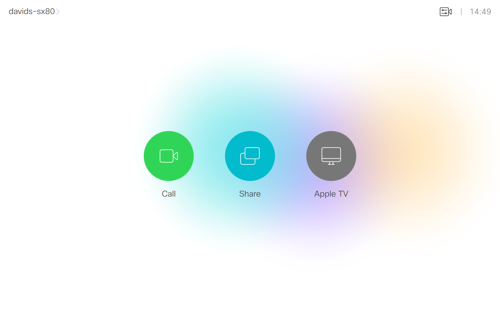
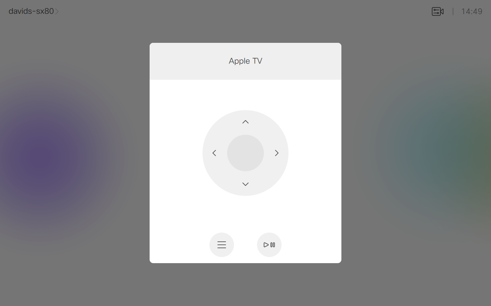

# Apple TV Controls
Add an Apple TV remote control to the touch 10. All communication is done directly via HDMI-CEC. No control system needed.

---
Snapshot of Touch Controller Home Screen Panel with Apple TV Control:

Snapshot of Touch Controller Home Screen Panel after pressing the Apple TV Control selector:

---

## Requirements
1. Cisco Video room device (Room Kit devices only)
2. Firmware CE9.2.1 or newer.
3. Apple TV
4. Admin user access to endpoint
5. CEC Mode enabled on the Input where the Apple TV is connected. See Setup

## Usage
1. Read the document "Working with Macros and In-room Controls" for an overview about In-Room Controls, Macros as well as step-by-step instructions on how to build and upload your code.

## Setup

1. Connect the Apple TV device to the Cisco Room Device on one of the HDMI Inputs.
2. Ensure that CEC is enabled for this HDMI input. This can be set using the configuration **xConfiguration Video Input Connector[*n*] CEC Mode** where *n* is the number of the HDMI input used.
3. Open up the AppleTV.js macro file. At the top of the macro there are two variables that you may need to configure.
    * *CODEC_CONNECTOR_ID_WHERE_APPLE_TV_IS_CONNECTED*: Set this to the same input number (n) as in step 2
    * *CEC_LOGICAL_ADDRESS_FOR_APPLETV*: This is the CEC device number that the APPLE TV will have gotten from the CEC device list. You can find the assigned logical address by looking at the input status on the video endpoint by issuing **xStatus Video Input Connector ConnectedDevice CEC LogicalAddress**

## Disclaimer
This example is only a sample and is **NOT guaranteed to be bug free and production quality**.

The sample macros are meant to:
- Illustrate how to use the CE Macros.
- Serve as an example of the step by step process of building a macro using JavaScript and integration with the Codec XAPI
- Provided as a guide for a developer to see how to initialize a macro and set up handlers for user and dialog updates.

The sample macros are made available to Cisco partners and customers as a convenience to help minimize the cost of Cisco Finesse customizations. Cisco does not permit the use of this library in customer deployments that do not include Cisco Video Endpoint Hardware.

## Support Notice
[Support](http://developer.cisco.com/site/devnet/support) for the macros is provided on a "best effort" basis via DevNet. Like any custom deployment, it is the responsibility of the partner and/or customer to ensure that the customization works correctly and this includes ensuring that the macro is properly integrated into 3rd party applications.

It is Cisco's intention to ensure macro compatibility across versions as much as possible and Cisco will make every effort to clearly document any differences in the XAPI across versions in the event that a backwards compatibility impacting change is made.

Cisco Systems, Inc. 
[http://www.cisco.com](http://www.cisco.com) 
[http://developer.cisco.com/site/roomdevices](http://developer.cisco.com/site/roomdevices)
