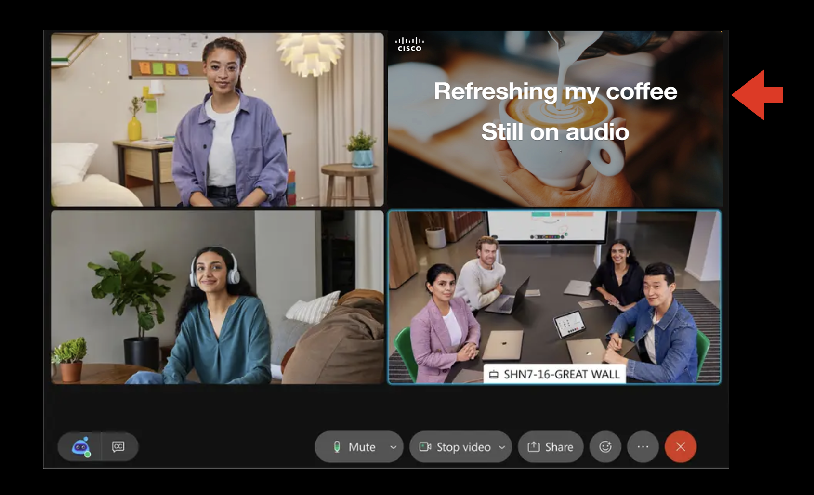
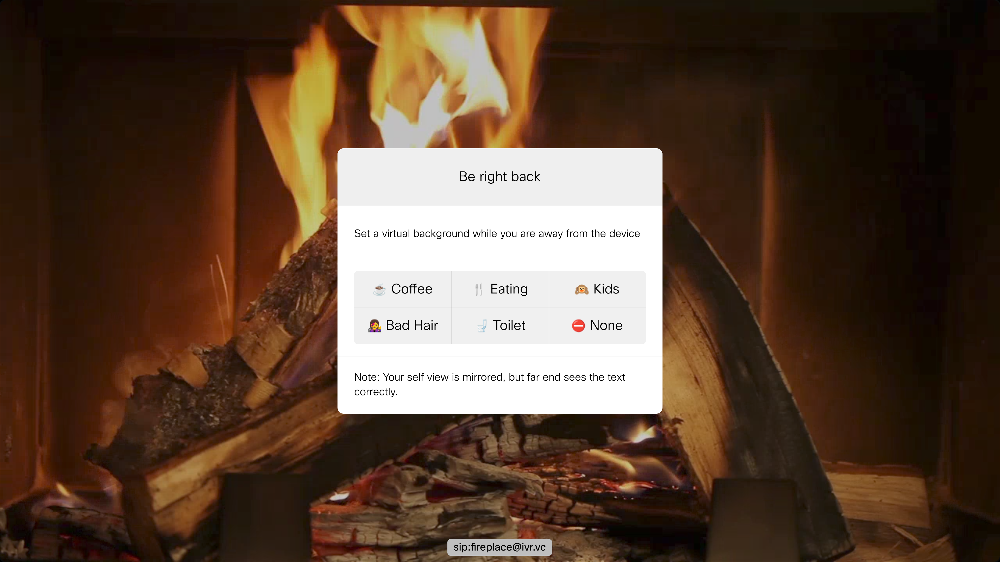
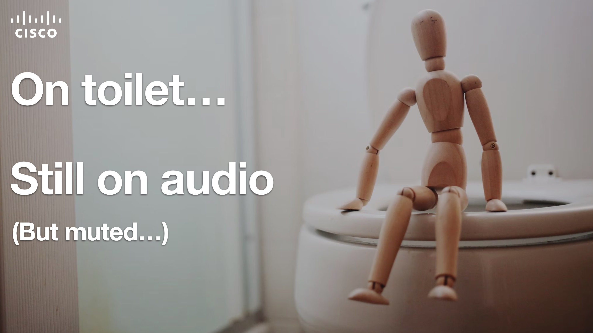

# Be Right Back

Set a virtual background displaying that you are away from device while in call, but still on audio.

---

On a video call on your Cisco Desk device, but need to step away for a bit, but still listening on audio? Let your colleagues know by setting a setting an availabily status like image as virtual background while you are away.

The extension will automatically detect when you are back in front of the device, and ask if you would like to remove the notice.

---

## Requirements

1. Cisco Desk device (Desk Pro, Desk, Desk Mini etc)
2. Firmware CE10 or newer.
3. Admin user access to endpoint
4. Coffee

## Usage

* Install the extension.
* A 'Be right back' button will appear in your call controls when you are in a call
* Tap it to choose your status when you step away from the desk
* When the system detects you are back in front of your device (with camera sensor), it will ask you if you want to disable the virtual background again

## Tweaking

You can easily edit the macro and:

* Set your own background images instead
* Set what kind of background you go back to after exiting Be Right Back mode
