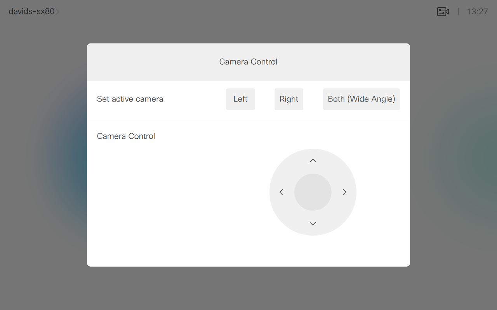

# Camera Controls
Allows the user to control multiple cameras using the touch controller. It also shows how to do simple video compositing stitching two cameras together as one wide angle image.

As a bonus, it also shows how to control whatever camera(s) are selected as the main source from one single UI extension.

---
Snapshot of Touch Controller Home Screen Panel for the camera control selector:

---

## Requirements
1. Cisco Video room device (Room Kit or SX80)
2. Firmware CE9.2.1 or newer.
4. Admin user access to endpoint

## Usage
1. Read the document [Working with Macros and In-room Controls](https://www.cisco.com/c/dam/en/us/td/docs/telepresence/endpoint/ce92/sx-mx-dx-room-kit-customization-guide-ce92.pdf)   for a comprehensive introduction to UI extensions and macros; as well as step-by-step instructions on how to build and upload your code.

## Setup
1. Connect two cameras to the Room Devices in two HDMI Inputs.

## Disclaimer
This example is only a sample and is **NOT guaranteed to be bug free and production quality**.

The sample macros are meant to:
- Illustrate how to use the CE Macros.
- Serve as an example of the step-by-step process of building a macro using JavaScript and integration with the device xAPI
- Provided as a guide for a developer to see how to initialize a macro and set up handlers for user and dialog updates.

The sample macros are made available to Cisco partners and customers as a convenience to help minimize the cost of Cisco Finesse customizations. Cisco does not permit the use of this library in customer deployments that do not include Cisco Video Endpoint Hardware.

## Support Notice
[Support](http://developer.cisco.com/site/devnet/support) for the macros is provided on a "best effort" basis via DevNet. Like any custom deployment, it is the responsibility of the partner and/or customer to ensure that the customization works correctly and this includes ensuring that the macro is properly integrated into 3rd party applications.

It is Cisco's intention to ensure macro compatibility across versions as much as possible and Cisco will make every effort to clearly document any differences in the xAPI across versions in the event that a backwards compatibility impacting change is made.

Cisco Systems, Inc. 
[http://www.cisco.com](http://www.cisco.com) 
[http://developer.cisco.com/site/roomdevices](http://developer.cisco.com/site/roomdevices)
