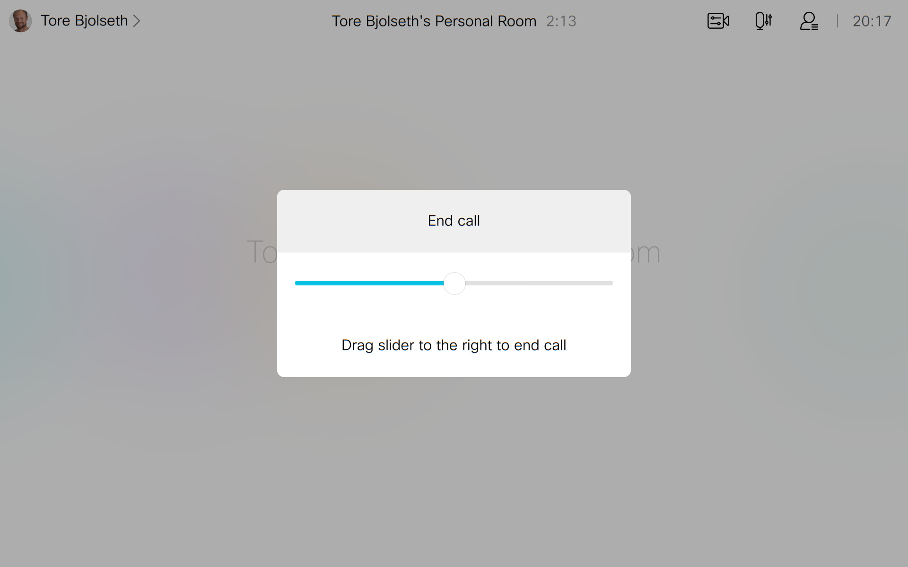
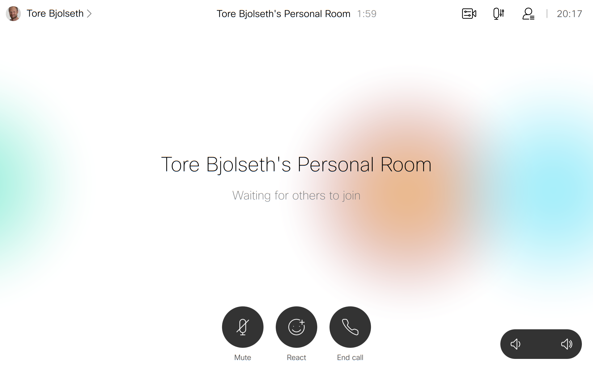

# Child Safe Controls
Replace the end call button with a slider to end the call.

Kids love hitting the red end call button, this macro replaces the button with a panel with a slider where you must drag the slider across to end the call.

The normal end call is available at night when the kids are sleeping.

In addition, the mute button is also disabled.
