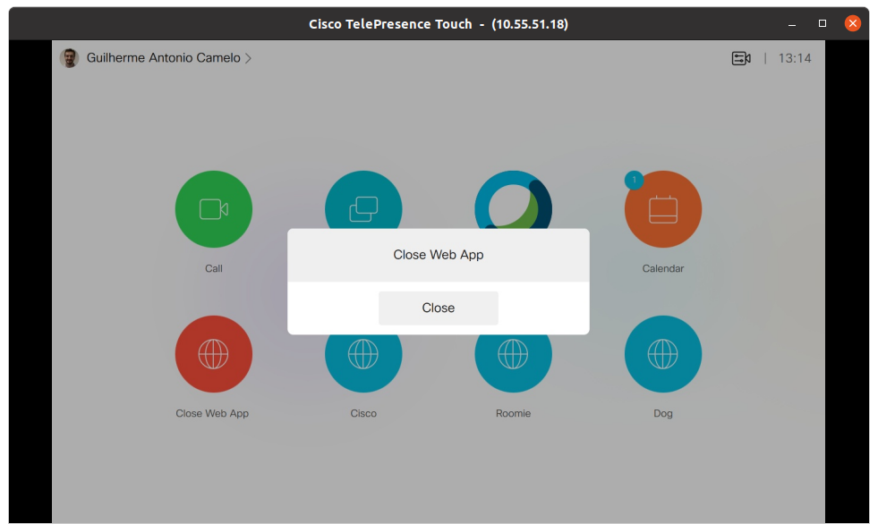
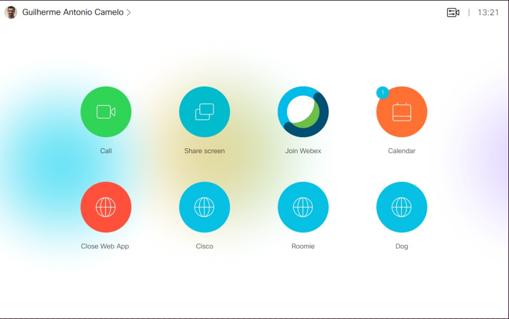

# Cisco CE Room Devices Macros - Close WebApp
This macro contains a close webapp/webview panel for non interactive devices that use Touch 10. The macro is self contained and only the file __WebApp Close.js__ is needed.

---
Snapshot of Touch 10 Home Screen Panel after a Webapp is open a close webapp panel appears on the touch:

Snapshot of Touch 10 Home Screen Panel after a Webapp is open a button to open the close panel appears on the touch :

---

This sample gadget contains the following files:

     macro-samples/
	Close WebApp/
		README.md (this file)
		WebApp Close.js (the macro)
		CloseWebAppHomeScreen.png (sample image)
		CloseWebAppPanel.png (sample image)

## Requirements
1. Cisco Video room device
2. Firmware CE9.12.1 or newer.
4. Admin user access to endpoint

## Usage
1. Read the document "Working with Macros and In-room Controls" for an overview about In-Room Controls, Macros as well as step-by-step instructions on how to build and upload your code.

## Setup

1. Open the JavaScript file `WebApp Close.js` and fill in the list `WebApps` on the top of the file. Add the WebApp name and url you wish to see in you home screen. In case you are only interested in the close webapp/webview panel, leave the webApps variable empty like so  `const webApps = []`. The macro have to be activated while the device is out of call. 

## Additional Information
##### XAPI
Documentation for the XAPI can be found in the [Command References overview](https://www.cisco.com/c/en/us/support/collaboration-endpoints/telepresence-quick-set-series/products-command-reference-list.html).

## Disclaimer
This example is only a sample and is **NOT guaranteed to be bug free and production quality**.

The sample macros are meant to:
- Illustrate how to use the CE Macros.
- Serve as an example of the step by step process of building a macro using JavaScript and integration with the Codec XAPI
- Provided as a guide for a developer to see how to initialize a macro and set up handlers for user and dialog updates.

The sample macros are made available to Cisco partners and customers as a convenience to help minimize the cost of Cisco Finesse customizations. Cisco does not permit the use of this library in customer deployments that do not include Cisco Video Endpoint Hardware.

## Support Notice
[Support](http://developer.cisco.com/site/devnet/support) for the macros is provided on a "best effort" basis via DevNet. Like any custom deployment, it is the responsibility of the partner and/or customer to ensure that the customization works correctly and this includes ensuring that the macro is properly integrated into 3rd party applications.

It is Cisco's intention to ensure macro compatibility across versions as much as possible and Cisco will make every effort to clearly document any differences in the XAPI across versions in the event that a backwards compatibility impacting change is made.

Cisco Systems, Inc. 
[http://www.cisco.com](http://www.cisco.com) 
[http://developer.cisco.com/site/roomdevices](http://developer.cisco.com/site/roomdevices)
