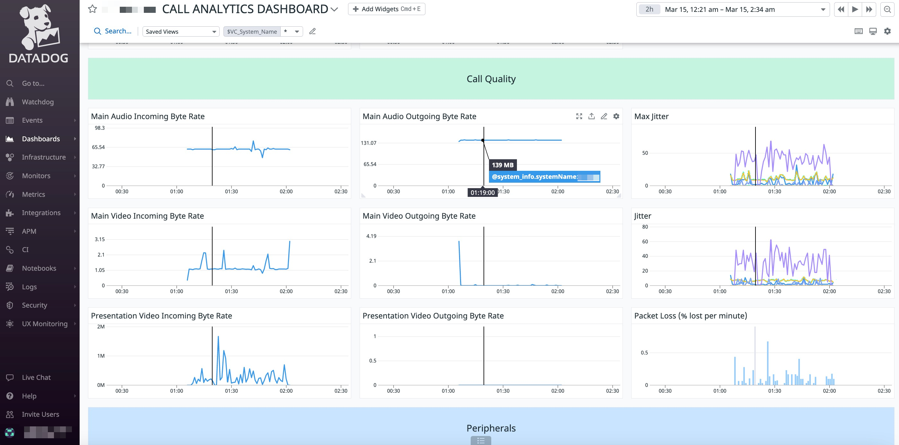

# Datadog Call Performance Monitoring

Visualize the performance of your conference calls in real time, and get alerts about degraded performance as it happens. 

---
Snapshot of a Datadog Dashboard once the macro is added and calls are live:

---

## Requirements

1. Cisco Video room device (Room Kit devices only)
2. Firmware CE10.0.0 or newer.
3. A [Datadog account](https://www.datadoghq.com/)

## Usage

1.  See the latest version of the [Cisco Webex Board, Desk, and Room Series Customization Guide](https://www.cisco.com/c/en/us/support/collaboration-endpoints/spark-room-kit-series/products-installation-and-configuration-guides-list.html) for a comprehensive introduction to UI extensions and macros; as well as step-by-step instructions on how to build and upload your code.

## Setup

### RoomKit Setup
1. Enable Macros on your device (`Configuration > Macros > Mode: On`)
2. Enable the HttpClient on your device (`Configuration > HttpClient > Mode: On`)
3. Add a new macro from the `datadog.js` file in this repo. 
4. Update the input parameters at the top of the macro code (`DD_TOKEN`, `DD_TAGS`, `CHECK_IF_CALL_FREQUENCY`, `IN_CALL_CHECK_FREQUENCY`, `IN_CALL_STATUS_COMMAND_LIST`, `GENERAL_CHECK_FREQUENCY`, `GENERAL_STATUS_COMMAND_LIST`, `MONITOR_PERIPHERALS`)
5. Save and enable your macro

### Datadog Account Setup

1. Create a Datadog dashbaord and [import](https://docs.datadoghq.com/dashboards/#copy-import-or-export-dashboard-json) the JSON definition found in `dashboard.json`
2. Create facets for all the data attributes listed in [next under "Additional Information"](#additional-information)

## Additional Information

This macro currently captures call performance data in the form of Datadog log events. When a call is active, you can find the performance data in your [Datadog log explorer here](https://app.datadoghq.com/logs?live=true&query=source%3Acisco_video_endpoint). 

To maximize value and functionality of this data in your Datadog account, create [facets](https://docs.datadoghq.com/logs/explorer/facets/#overview) for the log attributes that you care most about. We recommend at least creating facets for the following log attributes: 

- @command
- @device_data.Audio_Main_Incoming.ChannelRate
- @device_data.Audio_Main_Incoming.Jitter
- @device_data.Audio_Main_Incoming.Loss
- @device_data.Audio_Main_Incoming.MaxJitter
- @device_data.Audio_Main_Incoming.Packets
- @device_data.Audio_Main_Outgoing.ChannelRate
- @device_data.Audio_Main_Outgoing.Jitter
- @device_data.Audio_Main_Outgoing.MaxJitter
- @device_data.id
- @device_data.Status
- @device_data.Type
- @device_data.Video_Main_Incoming.ChannelRate
- @device_data.Video_Main_Incoming.Jitter
- @device_data.Video_Main_Incoming.MaxJitter
- @device_data.Video_Main_Outgoing.ChannelRate
- @device_data.Video_Presentation_Incoming.ChannelRate
- @device_data.Video_Presentation_Incoming.Jitter
- @device_data.Video_Presentation_Incoming.MaxJitter
- @device_data.Video_Presentation_Outgoing.ChannelRate
- @device_data.Video_Presentation_Outgoing.Jitter
- @device_data.Video_Presentation_Outgoing.MaxJitter
- @system_info.systemName

# Disclaimer

This example is only a sample and is **NOT guaranteed to be bug free and production quality**.

The sample macros are meant to:
- Illustrate how to use the CE Macros.
- Serve as an example of the step-by-step process of building a macro using JavaScript and integration with the device xAPI
- Provided as a guide for a developer to see how to initialize a macro and set up handlers for user and dialog updates.

The sample macros are made available to Cisco partners and customers as a convenience to help minimize the cost of Cisco Finesse customizations. Cisco does not permit the use of this library in customer deployments that do not include Cisco Video Endpoint Hardware.

## Support Notice

[Support](http://developer.cisco.com/site/devnet/support) for the macros is provided on a "best effort" basis via DevNet. Like any custom deployment, it is the responsibility of the partner and/or customer to ensure that the customization works correctly and this includes ensuring that the macro is properly integrated into 3rd party applications.

It is Cisco's intention to ensure macro compatibility across versions as much as possible and Cisco will make every effort to clearly document any differences in the xAPI across versions in the event that a backwards compatibility impacting change is made.

Cisco Systems, Inc. 
[http://www.cisco.com](http://www.cisco.com) 
[http://developer.cisco.com/site/roomdevices](http://developer.cisco.com/site/roomdevices)