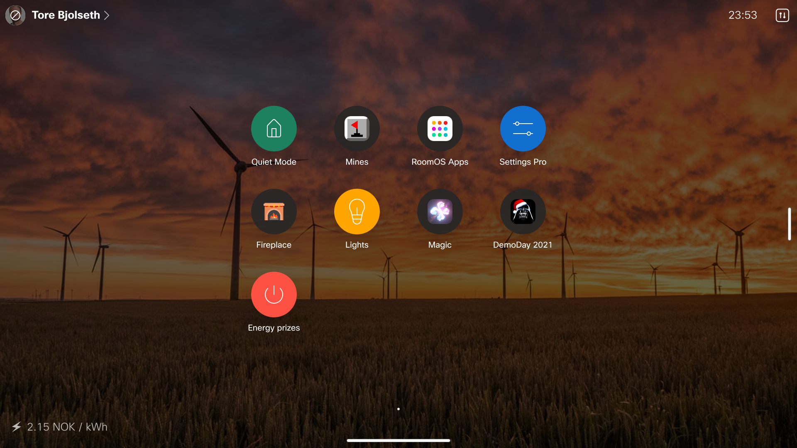
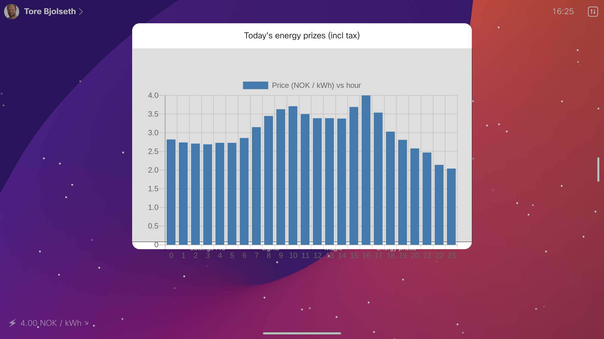

# Norwegian Energy Prices

Show the hourly Norwegian electricy price on the home screen, in the bottom left corner ('custom message').
Optionally also provides a home screen button to show a plot of todays prices.

Zone map: https://norgesenergi.no/hjelp/strompriser/historiske-strompriser/

Source: https://norway-power.ffail.win/?zone=NO1&date=2021-12-20 etc

The spot price for the current hour is displayed in the bottom left corner, as well as an arrow indicating whether the price will rise or fall the next hour.

## Code example

This is also a nice and simple example/tutorial of how to:

* Fetch data from external APIs
* Plot data easily in a web view without having your own web server (using quickcharts.io)
* Provide user options when installing extensions (see manifest.json)
* Make an integration that works on both touch screen and non-touch-screen devices
