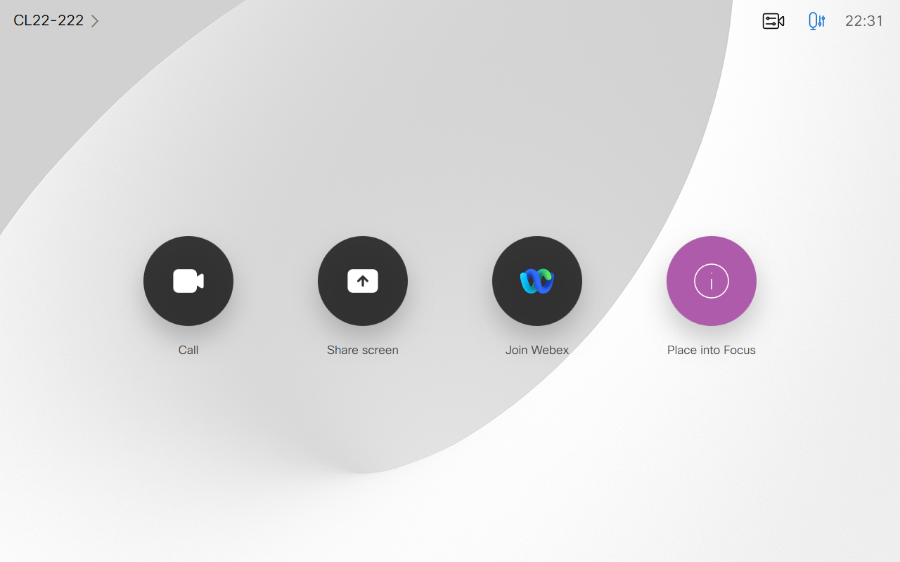

# In Focus

## What is GMM_In Focus?

GMM_In Focus is practical use of the GMM.Connect.IP() Class as well as GMM.read/write

This Macro was written for Webex Room Devices resting in a common Lab Environment

For those who are familiar with working on multiple Room Device in a lab environment you know that the Ultrasound Level interfere with testing on a particular device and calling out "Ok Webex" to invoke the assistant can be problematic in a lab. Traditionally, you as the admin would alter the config of the Audio MaxUltrasound Level as well as the Wakeword Mode configuration in order to eliminate these challenges.

GMM_In Focus provides a solution to this common lab dilemma by providing a panel button on your device that allows you to place this system into "Focus"; meaning, you're ready to work on this device, and silence the others.

When a device is placed into focus, Audio Ultrasound is set to 70 and the Wakeword for Webex Assistant is enabled. Using the GMM Library, a message is sent to all other devices in the configuration of the macro to set Audio Ultrasound to 0 and to disable the Wakeword for Webex assistant

Giving anyone who's working diligently in a lab, the ability to quickly switch to a device they need to "Focus" On without needing to manually adjust the config of all other devices in your lab.

## Installation

  - Modify the config object in GMM_In Focus.js to include all the devices in your lab
    - They must share common credentials and have their IPs defined
  - Install this modified version of GMM_In Focus.js and GMM_Lib.js on all your lab devices
  - Save both macros, and only Activate the GMM_In Focus.js macro
    - Leave GMM_Lib inactive at all times, as your active macros using GMM, will import the code
  - Once GMM_In Focus.js is active, a "Place into Focus" should appear on all devices
  
## Use
  - When you're ready to use a system, tap the "Place into Focus" button
  - This will tell normalize the Audio Max Ultrasound and Wakeword configuration for this device, and hide the "Place into Focus" button
    - Using GMM, the macro will tell all other devices to exit focus
      - This means their config for Audio Max Ultrasound will be set to 0 and the Wakeword feature will be disabled
      - The "Place into Focus" button will re-appear on systems that were previously in focus

|                   | **Robert(Bobby) McGonigle**          | **Gerardo Chaves**             |
|:------------------|:-------------------------------------|:--------------------------------|
| **Contribution**  | Author                               | Consulting Engineer            |
| **Title**         | Technical Marketing Engineer         | Technology Solutions Architect |
| **Org**           | Cisco Systems                        | Cisco Systems                  |
| **Contact**       | bomcgoni@cisco.com                   | gchaves@cisco.com              |
