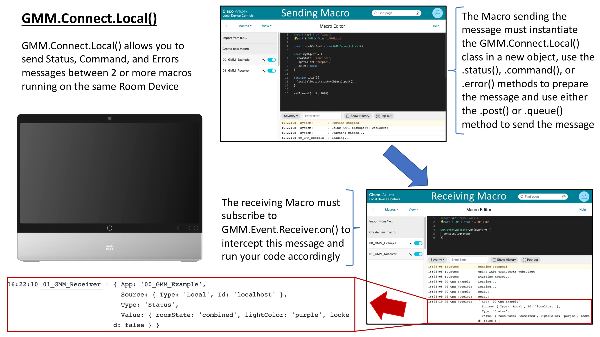
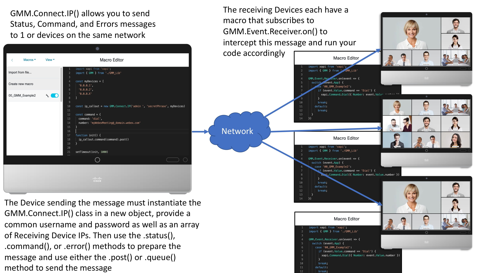
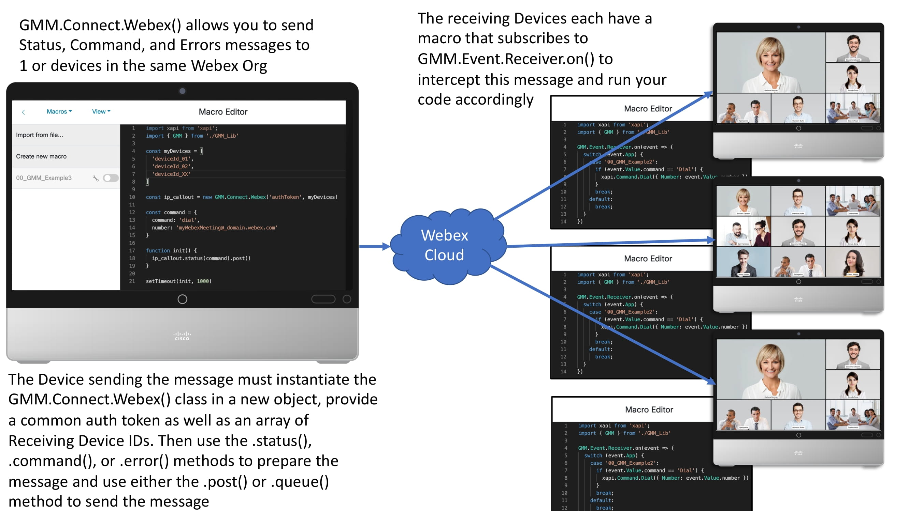
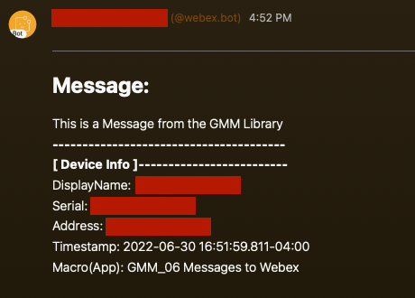
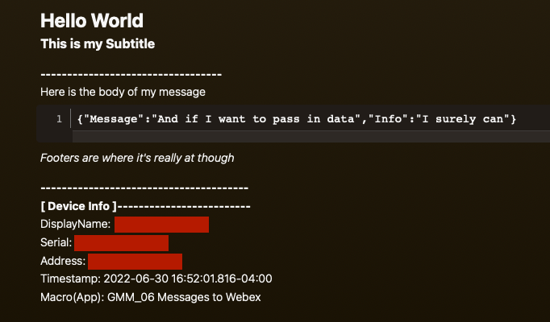

# Global Macro Messaging

## About
Global Macro Messaging (GMM) is a library of functions to standardize the communication across macros running locally on a Webex Room Device, between Room Devices on the same network, or Room Devices within the same Webex Control Hub instance.

GMM is meant to provide an integrator/developer a set of simple to use tools to provide consistent and meaningful context to your work as well as jump start development on more complex solutions involving multiple Webex Room Devices.

In addition to inter-macro/codec communication tools, GMM provides a developer the means to schedule tasks, read and write persistent data and a mechanism to post messages into the Webex App.

Feel free to Join the [GMM Community on Webex](https://eurl.io/#ANxvjGaT6)

Good luck and Happy Coding! :smiley:

[](https://github.com/CiscoDevNet/roomdevices-macros-samples/raw/master/Global%20Macro%20Messaging/GMM_Lib.js.zip) [](https://github.com/CiscoDevNet/roomdevices-macros-samples/raw/master/Global%20Macro%20Messaging/GMM_wExamples_v1-9-2.zip)

## Disclaimer
- When communicating to other devices using GMM know that writing authentication credentials or authorization tokens in your macros would be considered poor practice as any administrator to this device would be able to access this data
- The examples provided are meant to educate on how to use GMM, but it would be best if you could pass authentication into the function using a secure process, not to emulate the examples 1:1
- Please check with with your IT security team on best practices for your use case when developing integrations

## Features
- Create Status, Error and Command events within a macro to be intercepted by:
  - Another macro running on the same device
  - Another macro running on another device on the same Network
  - Another device within your Webex Organization
- Read and Write persistent data
  - Forked from [Macro Memory Storage](https://github.com/Bobby-McGonigle/Cisco-RoomDevice-Macro-Projects-Examples/tree/master/Macro%20Memory%20Storage)
  - Allows you to write data to a secondary macro, and read from that file within your script
- Task Scheduling
- Messaging into the Webex App

## Requirements
- A compatible Webex Room Device
  - Admin access to this device
- Working knowledge of
  - The Device xApi
  - The Webex APIs
  - ES6 Javascript and Best Practices

### Optional Requirements
- Admin access to your Webex Control Hub instance

## How to Install
- Download the GMM library

[](https://github.com/CiscoDevNet/roomdevices-macros-samples/raw/master/Global%20Macro%20Messaging/GMM_Lib.js.zip) [](https://github.com/CiscoDevNet/roomdevices-macros-samples/raw/master/Global%20Macro%20Messaging/GMM_wExamples_v1-9-2.zip)

- Import the GMM_Library to your Room Device's Macro Editor
- Save the Macro, but keep this macro Disabled
  - We're using GMM as a common library, no need to activate this Macro
  - The Macro Editor can only support 10 active macros (as of July 2022), but numerous inactive macros. It's best to leave library references like GMM inactive as we'll be importing these tools into your active scripts
- Import GMM into you're Macro Project

## Importing GMM into your Project
```javascript
//The xapi object is a standard import in all Macros
//  This let's you reference the xApi on the device
import xapi from 'xapi';

//GMM is imported in a similar manner
//  Add this line below the xApi import to include GMM
import { GMM } from './GMM_Lib'
```

## Use Cases GMM could solve for
- Multi-Codec use cases
  - Ex. Divisible Wall spaces
  - Custom Multi-Camera Arrangements
  - Custom Companion Codec solutions
- Custom Remote Management/Monitoring Tools
  - Have a Kiosk system notify a Webex Space
  - Give support staff a Desk System with controls to simplify their workflow
- Conflicts between complex macros
  - Handle macros using similar processes and maintain your experience
  - Add GMM and post messages between macros, rather than merging them
- Keep an open mind, I'm sure you can imagine more :smiley: 

## Author(s)

|                   | **Robert(Bobby) McGonigle**          | **Gerardo Chaves**             |
|:------------------|:-------------------------------------|:--------------------------------|
| **Contribution**  | Author                               | Consulting Engineer            |
| **Title**         | Technical Marketing Engineer         | Technology Solutions Architect |
| **Org**           | Cisco Systems                        | Cisco Systems                  |
| **Contact**       | bomcgoni@cisco.com                   | gchaves@cisco.com              |

## Acknowledgments
- Zacharie Gignac from Université Laval in Canada
  - His contributions to the memory storage functionality are invaluable

## GMM Library Reference

- Classes
  - [GMM.Connect.Local()](#)
    - Methods: ```.status(message)``` ```.command(message)``` ```.error(message)``` ```.post()``` ```.queue(id)```
  - [GMM.Connect.IP(CommonUsername, CommonPassword, ...IP_Array)](#)
    - Methods: ```.status(message)``` ```.command(message)``` ```.error(message)``` ```.passIP(stack)``` ```.passAuth(username, password)``` ```.post()``` ```.queue(id)```
  - [GMM.Connect.Webex(CommonAuthToken, ...DeviceId_Array)](#)
    - Methods: ```.status(message)``` ```.command(message)``` ```.error(message)``` ```.passDeviceId()``` ```.passAuth()``` ```.post()``` ```.queue(id)```
  - [GMM.Message.Webex.User(CommonAuthToken, ...UserEmail_Array)](#)
    - Methods: ```.body(message)``` ```.formattedBody(title, subtitle, body, data, footer)```
  - [GMM.Message.Webex.Room(CommonAuthToken, ...RoomId_Array)](#)
    - Methods: ```.body(message)``` ```.formattedBody(title, subtitle, body, data, footer)```
- Subscriptions
  - [GMM.Event.Receiver.on(callBack)](#)
  - [GMM.Event.Queue.on(callBack)](#)
  - [GMM.Event.Schedule.on(24hourTime, callBack)](#)
- Functions
  - [GMM.memoryInit()](#)
  - [GMM.read(key)](#)
    - GMM.read.global(key)
    - GMM.read.all(key)
  - [GMM.write(key, value)](#)
    - GMM.write.global(key, value)
- - -

### Classes
- - -

#### GMM.Connect.Local()
- Class
- Used for Inter-Macro communication on the same device
- Works for On-Premise, Edge for Devices, or Full Cloud deployments

|Method|Description|
|:---|:---|
|.status(message)|Prepares a Status message. Requires a string or JSON object literal. To be followed by .post() or .queue(id) method|
|.command(message)|Prepares a Command message. Requires a string or JSON object literal. To be followed by .post() or .queue(id) method|
|.error(message)|Prepares a Error message. Requires a string or JSON object literal. To be followed by .post() or .queue(id) method|
|.post()|Async. Sends payload off into the system to be caught by GMM.Event.Receiver.on() subscription|
|.queue(id)|Places payload into a queue to be later posted by the GMM.Event.Queue.on() subscription in 250ms intervals. GMM.Event.Receiver.on() subscription still required to intercept message|

Use
```javascript
import xapi from 'xapi';
import { GMM } from './GMM_Lib'

//Instantiate new GMM.Connect.Local() object
const localCallout = new GMM.Connect.Local()

//Post a status
localCallout.status('Test Status String').post()

//Queue a command
localCallout.command('Test Command String').queue('ID_001')

//Post an Error with JSON object literal
const myObject = {
  Error: 'An error occured',
  Cause: 'Unknown',
  Action: 'No recommended action at this time'
}
localCallout.error(myObject).post()
```
Visual Design Aid

[](#)
- - -

#### GMM.Connect.IP(CommonUsername, CommonPassword, IP_Array)
- Class
- Used for Inter-Macro communication between Webex Room devices via IP communication, using the putxml API
- Requires Local Admin account
- Works for On-Premise, Edge for Devices, or Full Cloud deployments

|Method|Description|
|:---|:---|
|.status(message)|Prepares a Status message. Requires a string or JSON object literal. To be followed by .post() or .queue(id) method|
|.command(message)|Prepares a Command message. Requires a string or JSON object literal. To be followed by .post() or .queue(id) method|
|.error(message)|Prepares a Error message. Requires a string or JSON object literal. To be followed by .post() or .queue(id) method|
|.passIP(stack)|Default value: 'v4'. Appends this device's IPv4 address to the payload. Replace stack parameter with 'v6' to append IPv6 address|
|.passAuth(username, password)|Passes along the username and password to the receiving CODEC as an encoded string|
|.post()|Async. Sends payload off into the system to be caught by GMM.Event.Receiver.on() subscription|
|.queue(id)|Places payload into a queue to be later posted by the GMM.Event.Queue.on() subscription in 250ms intervals. GMM.Event.Receiver.on() subscription still required to intercept message|

Use
```javascript
import xapi from 'xapi';
import { GMM } from './GMM_Lib'

//Instantiate new GMM.Connect.IP() object
const ip_callout = new GMM.Connect.IP('CommonUsername', 'CommonPassword', ipAddress_1, ipAdress_2, ...) //Accepts 1 or More IP addresses

//Post a status
ip_callout.status('Test Status String').post()

//Queue a command
ip_callout.command('Test Command String').queue()

//Post an Error with JSON object literal
const myObject = {
  Error: 'An error occured',
  Cause: 'Unknown',
  Action: 'No recommended action at this time'
}
ip_callout.error(myObject).post()

//Append IPv4/IPv6
ip_callout.status('Test Status String').passIP().post()
ip_callout.command('Test Command String').passIP('v6').post()

//Append Auth
ip_callout.status('Test Status String').passAuth('myUsername', 'mySecretCode').post()

//Append IP & Auth
ip_callout.command('Test Command String').passIP('v6').passAuth('myOtherUsername', 'myOtherSecretCode').post()
```
Visual Design Aid

[](#)
- - -

#### GMM.Connect.Webex(CommonAuthToken, DeviceId_Array)
- Class
- Used for Inter-Macro communication between Webex Room devices via Webex Cloud xApi communication
- Requires Bot Token
- Requires Edge for Devices or Full Cloud Registration

|Method|Description|
|:---|:---|
|.status(message)|Prepares a Status message. Requires a string or JSON object literal. To be followed by .post() or .queue(id) method|
|.command(message)|Prepares a Command message. Requires a string or JSON object literal. To be followed by .post() or .queue(id) method|
|.error(message)|Prepares a Error message. Requires a string or JSON object literal. To be followed by .post() or .queue(id) method|
|.passDeviceId()|Appends this device's Cloud Device ID to the payload.|
|.passAuth()|Appends auth token initialized in the object to the receiving CODEC|
|.post()|Async. Sends payload off into the system to be caught by GMM.Event.Receiver.on() subscription|
|.queue(id)|Places payload into a queue to be later posted by the GMM.Event.Queue.on() subscription in 250ms intervals. GMM.Event.Receiver.on() subscription still required to intercept message|

Use
```javascript
import xapi from 'xapi';
import { GMM } from './GMM_Lib'

//Instantiate new GMM.Connect.Webex() object
const webex_callout = new GMM.Connect.Webex('myToken', deviceId_1, deviceId_2, ...) //Accepts 1 or More Device IDs

//Post a status
webex_callout.status('Test Status String').post()

//Queue a command
webex_callout.command('Test Command String').queue()

//Post an Error with JSON object literal
const myObject = {
  Error: 'An error occured',
  Cause: 'Unknown',
  Action: 'No recommended action at this time'
}
webex_callout.error(myObject).post()

//Append Device ID
webex_callout.status('Test Status String').passDeviceId().post()

//Append Auth
webex_callout.status('Test Status String').passAuth().post()

//Append Device ID & Auth
webex_callout.command('Test Command String').passDeviceId().passAuth().post()
```
Visual Design Aid

[](#)
- - -

#### GMM.Message.Webex.User('CommonAuthToken', email_Array)
- Class
- Used to post Messages to users on the Webex App
- Requires Bot Token
- Requires Access to Webex Cloud

|Method|Description|
|:---|:---|
|.body(message)|Prepares body as a markdown string. To be followed by .post() method|
|.formattedBody(title, subtitle, body, data, footer)|Prepares a pre-formatted markdown string. To be followed by .post() method|
|.post()|Async. Sends payload off to Webex|

Use
```javascript
import xapi from 'xapi';
import { GMM } from './GMM_Lib'

//Instantiate new GMM.Message.Webex.User() object
const report = new GMM.Message.Webex.User('myToken', user_Email_1, user_Email_2, ...) // Accepts 1 or More email addresses

//Send message to webex
report.body('My Simple Message to Webex').post()

//Send Pre-formatted message to Webex
report.body('Alert', 'Out of snacks in the cafeteria', 'We should convince upper management to provide hot meals in addition to keeping to snacks at the ready', 'Last known snack break: 13:45', '- Room 5025').post()
```
- - -

#### GMM.Message.Webex.Room()
- Class
- Used to post Messages to specific Rooms IDs on the Webex App
  - The bot must be added to the space before sending messages, else this will error
- Requires Bot Token
- Requires Access to Webex Cloud

|Method|Description|
|:---|:---|
|.body(message)|Prepares body as a markdown string. To be followed by .post() method|
|.formattedBody(title, subtitle, body, data, footer)|Prepares a pre-formatted markdown string. To be followed by .post() method|
|.post()|Async. Sends payload off to Webex|

Use
```javascript
import xapi from 'xapi';
import { GMM } from './GMM_Lib'

//Instantiate new GMM.Message.Webex.Room() object
const report = new GMM.Message.Webex.Room('myToken', roomID_1, roomID_2, ...) // Accepts 1 or More Room IDs
// Be sure to add this bot to each Room ID before posting message, else this will error

//Send message to webex
report.body('My Simple Message to Webex').post()

//Send Pre-formatted message to Webex
report.body('Alert', 'Out of snacks in the cafeteria', 'We should convince upper management to provide hot meals in addition to keeping to snacks at the ready', 'Last known snack break: 13:45', '- Room 5025').post()
```
- - - 

Example Message output on the Webex App for both [GMM.Message.Webex.User/Room()](#)

Using .body(message)

[](#)

Using .formattedBody(message)

[](#)
- - - 

### Subscriptions
- - -

#### GMM.Event.Receiver.On(callBack)
- Subscription
- Used to intercept messages sent by GMM.Connect.Local(), GMM.Connect.IP(), and GMM.Connect.Webex()

Event Payload Format
|Key|Value|
|:---|:---|
|App|Name of the Macro responsible for sending this message|
|Source|Type: which class was used to send this payload; Id: Serial address of sending device, unless sent locally. Source may contain additional Keys for Auth, IPv4, IPv6, or Device ID|
|Type| Message type: Status, Command, Error|
|Value| Message string or JSON Object Literal sent by GMM.Connect.Local(), GMM.Connect.IP(), and GMM.Connect.Webex()|


Use
```javascript
import xapi from 'xapi';
import { GMM } from './GMM_Lib'

GMM.Event.Receiver.On(event => {
  console.log(event)
})
/*
Example Event Payload
{ 
  App: 'Macro_Name',
  Source: { Type: 'Local', Id: 'localhost' },
  Type: 'Status',
  Value: 'Sending a Status' 
}
*/
```
- - - 

#### GMM.Event.Queue.on(callBack)
- Subscription
- Used to processed any object using the .queue(id) method
- If GMM.Event.Queue.on(callBack) is not declared, you're queued requests will not run
- Must run in the same script that is queuing these requests

Event Payload Format
|Key|Value|
|:---|:---|
|Queue_ID|Current ID processed in the queue. Used for request tracking|
|Response|HTTPClient Responses|
|QueueStatus| Contains a count of remaining queued items, a pool of IDs left in the queue, and the current delay of the queue|


Use
```javascript
import xapi from 'xapi';
import { GMM } from './GMM_Lib'

GMM.Event.Queue.On(event => {
  console.log(event)
})
/*
Example Event Payload
{ 
  Queue_ID: 'undefined',
  Response: { "Response from HTTP Client" },
  QueueStatus:
   { RemainingRequests: 2,
     IdPool: [ '_01', '_02' ],
     CurrentDelay: '250 ms' } 
}
*/
```
- - -

#### GMM.Event.Schedule.on(24HourTime, callBack)
- Subscription
- Used to schedule repeatable tasks based on the devices local time
- 24HourTime = 00:00 > 23:59

Use
```javascript
import xapi from 'xapi';
import { GMM } from './GMM_Lib';

GMM.Event.Schedule.on('04:00', event => {
  console.log(event)
  //Run the code you need to run at 4am here
})

GMM.Event.Schedule.on('14:00', event => {
  //Run the code you need to run at 2pm here
})
```
- - -

### Functions
- - -

#### GMM.memoryInit()
- Asynchronous
- Checks to see if the ```Memory_Storage``` macro is installed on your device
  - If ```Memory_Storage``` is missing, it will create memory storage, to ensure you have a place to read and write from
- Call this when your script initializes

Use
```javascript
import xapi from 'xapi';
import { GMM } from './GMM_Lib';

async function init(){
  //Call GMM.memoryInit() when your script initializes
  await GMM.memoryInit()
}

init()
```
- - -

#### GMM.read(key)
- Asynchronous
- Reads a key from the Memory_Storage macro
- Data read is unique to the Macro that this function is called in

Use
```javascript
import xapi from 'xapi';
import { GMM } from './GMM_Lib';

async function init(){
  await GMM.memoryInit()
  try {
    const data = await GMM.read('customStatus')
    console.log(data)
  } catch (e){
    console.error(e)
  }
}

init()
```
- - -

#### GMM.read.global(key)
- Asynchronous
- Reads a key from the Memory_Storage macro
- Data read using .global() can access data from other macros by referencing the macro name as the key

Use
```javascript
import xapi from 'xapi';
import { GMM } from './GMM_Lib';

async function init(){
  await GMM.memoryInit()
  try {
    const data = await GMM.read.global('macroName')
    console.log(data)
  } catch (e){
    console.error(e)
  }
}

init()
```
- - -

#### GMM.read.all()
- Asynchronous
- Reads a key from the Memory_Storage macro
- Data read using .all() accesses all data found in Memory_Storage

Use
```javascript
import xapi from 'xapi';
import { GMM } from './GMM_Lib';

async function init(){
  await GMM.memoryInit()
  try {
    const data = await GMM.read.all()
    console.log(data)
  } catch (e){
    console.error(e)
  }
}

init()
```
- - -

#### GMM.write(key, value)
- Asynchronous
- Writes a key and a Value for that key to the Memory_Storage macro
  - The Value can be a string or a JSON object literal
- Data written to Memory_Storage is unique to the key provided
  - If you write to the same key, that key will be overwritten

Use
```javascript
import xapi from 'xapi';
import { GMM } from './GMM_Lib';

async function init(){
  await GMM.memoryInit()
  
  //Writing a string to Memory_Storage
  GMM.write('myKey', 'Hello World')
  
  //Writing a JSON object literal to Memory_Storage
  const myData = {
    roomState: 'combined',
    shadeState: 'lowered',
    favoriteColor: 'purple'
  }
  GMM.write('room_Info', myData)
}

init()
```
- - -

#### GMM.write.global(key, value)
- Asynchronous
- Writes a key and a Value for that key to the Memory_Storage macro
  - The Value can be a string or a JSON object literal
- Data written to Memory_Storage is unique to the key provided
  - If you write to the same key, that key will be overwritten
- Data written using .global() can overwrite data stored by any macro or be used to create a custom global object to store data into

Use
```javascript
import xapi from 'xapi';
import { GMM } from './GMM_Lib';

async function init(){
  await GMM.memoryInit()
  
  //Writing a string to Memory_Storage
  GMM.write.global('myKey', 'macroName')
  
  //Writing a JSON object literal to Memory_Storage
  const customGlobalObject = {
    roomState: 'combined',
    shadeState: 'lowered',
    favoriteColor: 'purple'
  }
  GMM.write('room_Info', customGlobalObject)
}

init()
```
