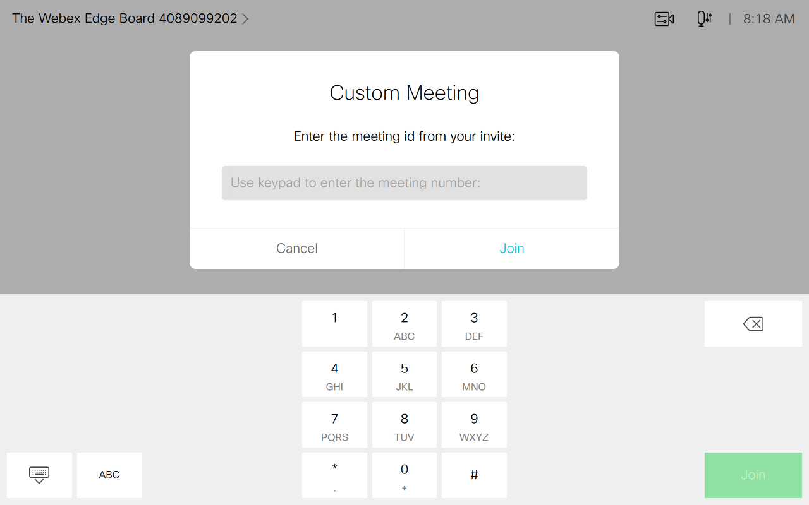

# Join 3rd Party Meeting UI
A Join Meeting Panel/Text Input lets you join 3rd party non-Webex meetings.

You can customize the postfix const in __JoinMeetingGeneric.js__ to simplfy your Join Meeting experience to virtually any 3rd party conferencing platform that supports Standard SIP dialling.  Such as @zoomcrc.com, @MSFT.tenant, or @yourdomain.com

---
Snapshot of Touch Controller Home Screen Panel showing the Join Meeting Button:

Snapshot of Touch Controller Home Screen Panel after the Join Meeting Button has been pressed:

---

## Requirements
1. Cisco Video room device
2. Firmware CE9.X or newer.
4. Admin user access to endpoint

## Usage
1.  See the latest version of the [Cisco Webex Board, Desk, and Room Series Customization Guide](https://www.cisco.com/c/en/us/support/collaboration-endpoints/spark-room-kit-series/products-installation-and-configuration-guides-list.html)    for a comprehensive introduction to UI extensions and macros; as well as step-by-step instructions on how to build and upload your code.

## Setup

1. Open the JavaScript file `JoinMeetingGeneric.js` and fill in the `postfix` and 'panelID' on the top of the file. The macro should be set to be activated while the device is out of call.
2. Add either the 'JoinMeetingPanel.xml' to the UI Extension Editor or create your own with the panelID associated with the 'JoinMeetingGeneric.js' macro.

## Disclaimer
This example is only a sample and is **NOT guaranteed to be bug free and production quality**.

The sample macros are meant to:
- Illustrate how to use the CE Macros.
- Serve as an example of the step-by-step process of building a macro using JavaScript and integration with the device xAPI
- Provided as a guide for a developer to see how to initialize a macro and set up handlers for user and dialog updates.

The sample macros are made available to Cisco partners and customers as a convenience to help minimize the cost of Cisco Finesse customizations. Cisco does not permit the use of this library in customer deployments that do not include Cisco Video Endpoint Hardware.

## Support Notice
[Support](http://developer.cisco.com/site/devnet/support) for the macros is provided on a "best effort" basis via DevNet. Like any custom deployment, it is the responsibility of the partner and/or customer to ensure that the customization works correctly and this includes ensuring that the macro is properly integrated into 3rd party applications.

It is Cisco's intention to ensure macro compatibility across versions as much as possible and Cisco will make every effort to clearly document any differences in the xAPI across versions in the event that a backwards compatibility impacting change is made.

Cisco Systems, Inc. 
[http://www.cisco.com](http://www.cisco.com) 
[http://developer.cisco.com/site/roomdevices](http://developer.cisco.com/site/roomdevices)
