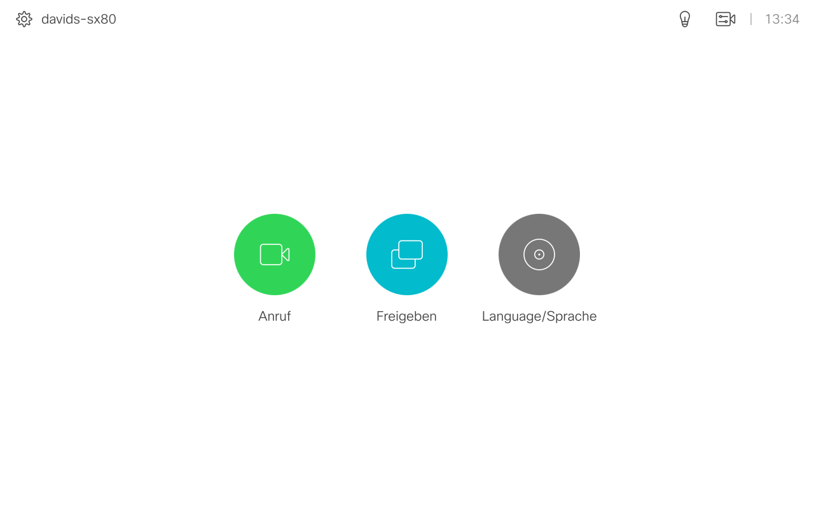
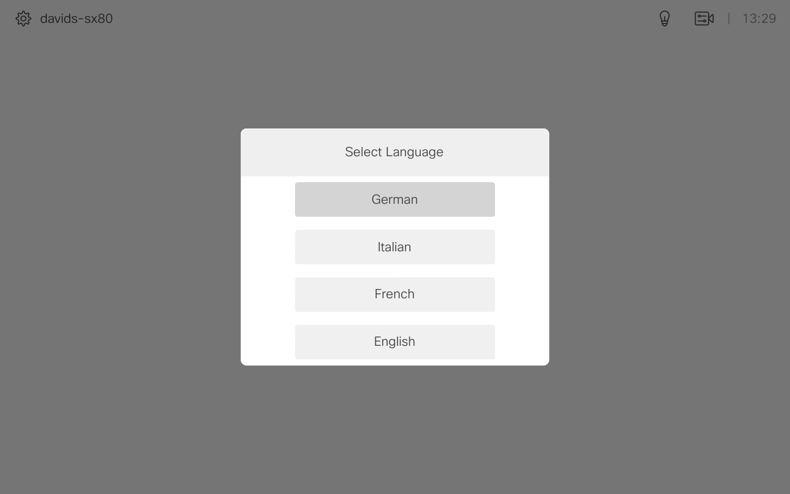

# Language Selector
This macro and corresponding UI extension demonstrates how to create an application that allows the user to select the
menu language on the touch screen of the video device.

Snapshot of Touch Controller Home Screen Panel with language selector:

Snapshot of Touch Controller Home Screen Panel after pressing the language selector:

## Requirements
1. Cisco Video endpoint (MX, SX, DX and Room Kit devices)
2. Firmware CE9.2.1 or newer.
3. Admin user access to endpoint

## Usage
1.  See the latest version of the [Cisco Webex Board, Desk, and Room Series Customization Guide](https://www.cisco.com/c/en/us/support/collaboration-endpoints/spark-room-kit-series/products-installation-and-configuration-guides-list.html)    for a comprehensive introduction to UI extensions and macros; as well as step-by-step instructions on how to build and upload your code.

## Additional Information
##### xAPI
Documentation for the xAPI can be found in the [Command References overview](https://www.cisco.com/c/en/us/support/collaboration-endpoints/telepresence-quick-set-series/products-command-reference-list.html).

## Disclaimer
This example is only a sample and is **NOT guaranteed to be bug free and production quality**.

The sample macros are meant to:
- Illustrate how to use the CE Macros.
- Serve as an example of the step-by-step process of building a macro using JavaScript and integration with the device xAPI
- Provided as a guide for a developer to see how to initialize a macro and set up handlers for user and dialog updates.

The sample macros are made available to Cisco partners and customers as a convenience to help minimize the cost of Cisco Finesse customizations. Cisco does not permit the use of this library in customer deployments that do not include Cisco Video Endpoint Hardware.

## Support Notice
[Support](http://developer.cisco.com/site/devnet/support) for the macros is provided on a "best effort" basis via DevNet. Like any custom deployment, it is the responsibility of the partner and/or customer to ensure that the customization works correctly and this includes ensuring that the macro is properly integrated into 3rd party applications.

It is Cisco's intention to ensure macro compatibility across versions as much as possible and Cisco will make every effort to clearly document any differences in the xAPI across versions in the event that a backwards compatibility impacting change is made.

Cisco Systems, Inc. 
[http://www.cisco.com](http://www.cisco.com) 
[http://developer.cisco.com/site/roomdevices](http://developer.cisco.com/site/roomdevices)
