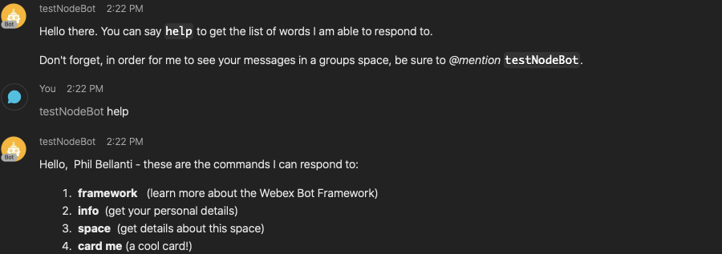

# Send Webex Message

This is a macro module that let's you send a message to a Webex user or a Webex room, using the HTTP Client command.
It is a macro module, so you can import it in your own macros and use it, it does not do anything on its own.



The sender of the message will be a bot. You can create the bot user at [developer.webex.com](https://developer.webex.com) by signing in there and choosing **My Webex Apps**. Copy the token and use it like in the example below.

Usage:

```
import webex from ‘./webex’;

const yourBotToken = ‘…’; // add it

webex.sendMessage(yourBotToken, ‘tbjolset@cisco.com’, null, ‘Send markdown message to me **personally**’);

webex.sendMessage(yourBotToken, null, ‘yourRoomId’, ‘Bot must be member of any group spaces you send to’);
```

You can also use all the other APIs at developer.webex.com in similar fashion to poll messages, create rooms, add members etc.

**Note**: If you want to send a message to a group room, the bot must be a member of that room.

## Requirements

* [xConfig HttpClient Mode](https://roomos.cisco.com/xapi/Configuration.HttpClient.Mode/) must be `On`.
