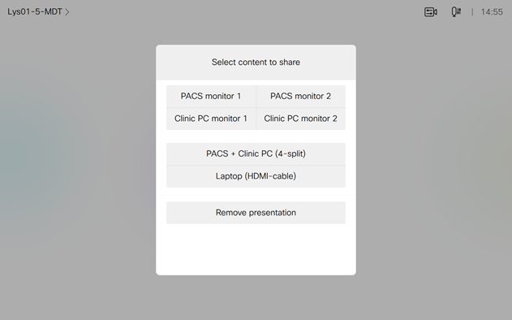

# Multi-Content Solution

This is the macro and UI Extension used in the [Multi-Content Solution](https://projectworkplace.cisco.com/workspaces/special-purpose-rooms/multi-content/multi-content) in Project Workplace.
The panel allow you to share either a single source, or a combination of 4.

You can customize the text on the widgets using the __UI Extension editor__.

**Author: Svein Terje Steffensen**

Warning: This extension is not currently supported by RoomOS 11 / the new multi-taksing user interface.

---
Snapshot of Room Navigator after the "MDT Demo" button has been pressed:

---

## Requirements
1. Cisco Room Kit Pro or Room 70S G2
2. Firmware CE9.15X or newer.
3. Admin user access to endpoint

## Usage
1. Please read the [MCS Deployment Guide](MCS%20Deployment%20guide.pdf) for an overview about how to set up and configure the Multi-Content Solution.

## Disclaimer
This code is tested and found working with RoomOS 9.15.3 and RoomOS 10.6.0, but can still contain errors. Please report issues found.

The macro is made available to Cisco partners and customers as a convenience to help simplify deploying the Multi-Content Solution. Cisco does not permit the use of this library in customer deployments that do not include Cisco Video Endpoint Hardware.

## Support Notice
[Support](http://developer.cisco.com/site/devnet/support) for the macros is provided on a "best effort" basis via DevNet. Like any custom deployment, it is the responsibility of the partner and/or customer to ensure that the customization works correctly and this includes ensuring that the macro is properly integrated into 3rd party applications. This is particularly true if the  Multi-Content Solution is customized.

It is Cisco's intention to ensure macro compatibility across versions as much as possible and Cisco will make every effort to clearly document any differences in the xAPI across versions in the event that a backwards compatibility impacting change is made.

Cisco Systems, Inc. 
[http://www.cisco.com](http://www.cisco.com) 
[http://developer.cisco.com/site/roomdevices](http://developer.cisco.com/site/roomdevices)
