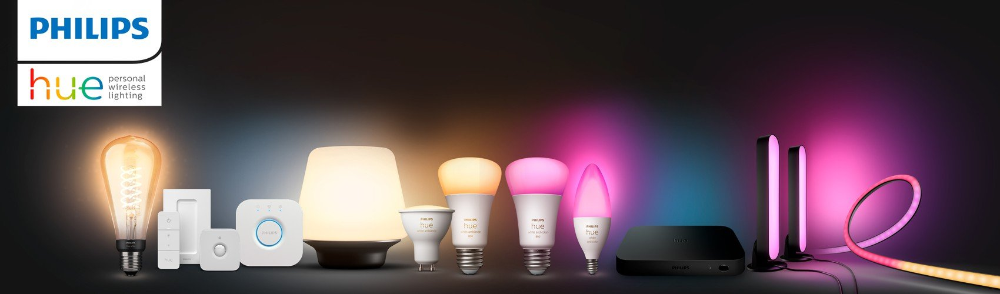
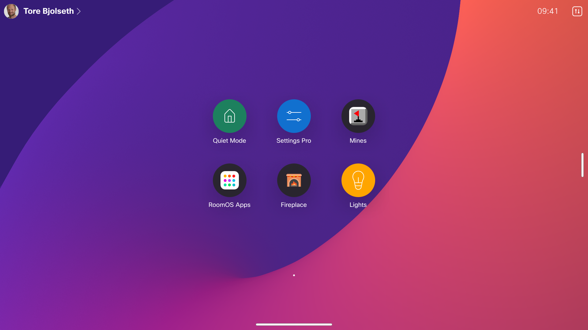
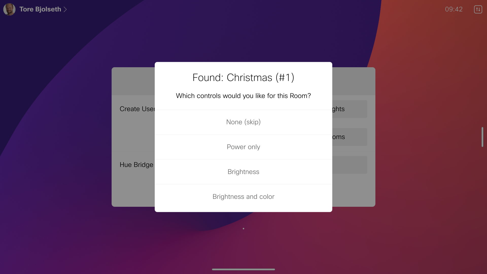
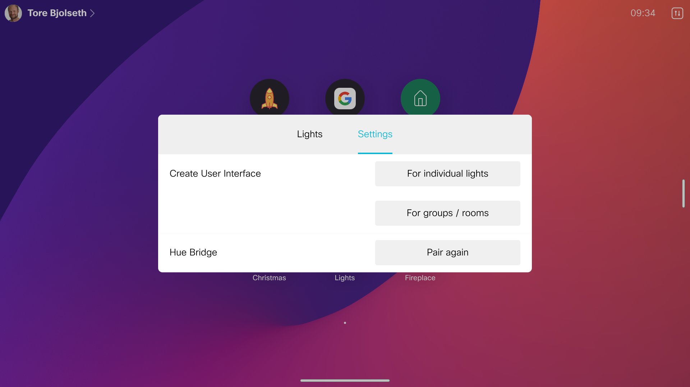

# Philips Hue

Easily discover and connect to your Philips Hue ecosystem and control individual lights
or groups/rooms from your Webex device.







## Description

Nice if you want to:

* Control the light in your home office or other rooms without opening your phone
* Make the lights react to events on your device, such as incoming call, meeting starting
* Show others you busy / in-call by making an indicator lamp red
* Set the light color to match your virtual background, for a more realistic view
* Control other peripherals in your home with the Philips Hue Smart Plug


## Customise it yourself

This extension let's you easily connect to the Hue bridge and create a stanard user interface for you lights,
using UI Extensions. However, you may want to customize the user interface to exact purpose. You can do quite a
lot without any programming by adding UI extensions that giving the specific widget ids.

The widget will automatically control a specified light or group by having a widget id that matches this format:

```
huectrl-<id>-<controltype>
```

Where id is either light id or group id. Control type can be:

```
on: set power on or off (typically from switch)
toggle: toggle power to opposite (typically from push button)
bri: brightness (use slider)
col: color hue (slider or button group)
sat: color saturation (slider or button group)
```

Example: A home screen button to quickly toggle on/off a single light or room

* Add an **action button** from the UI extensions
* To toggle light #7, give id the panel id **huectrl-7-on**
* To toggle brightness for light #3, give the slider widget id **huectrl-3-bri**


## Requirements

* CE 9.1 or greater
* Supported on both Touch 10 and devices with touch screen, such as Desk Pro and the Webex Board
* Philips Hue bridge
* Video device on same network as Hue bridge (or at least reachable)
* Philips Hue bridge and lights already configured (eg from phone app)

## Note

This macro uses the `xConfig FacilityService[4] Name` to store the user's preferences, so you should not install it if you are using facility service actively on your device.

## Network tip

If you are using the Hue in a corporate network environment, you may have problems finding the IP address of the Hue bridge, if you don't happen to have the Cisco device connected to the same subnet as the bridge. A tip in this case may be to connect the bridge to the PoE output port of the collab device instead. The bridge will then get a fixed IP address of **169.254.1.30**. You then need to comment out the line in *hue-lib.js* in *discoverBridge()* so it instead says:

```
    // this.ip = body[0].internalipaddress;
    this.ip = '169.254.1.30';
```

Save the file and your device should now be able to talk to the bridge.

You can also do the same trick if you happen to know the IP address of the bridge by other means. In some networks, you might be able to use the MAC address of the bridge as hostname. The MAC address is printed on the back of the bridge - it's located with a bar code and 6 letters/digits, and you need to add '00:17:88' in front for the full address. See https://huetips.com/help/how-to-find-my-hue-bridge-mac-address.
