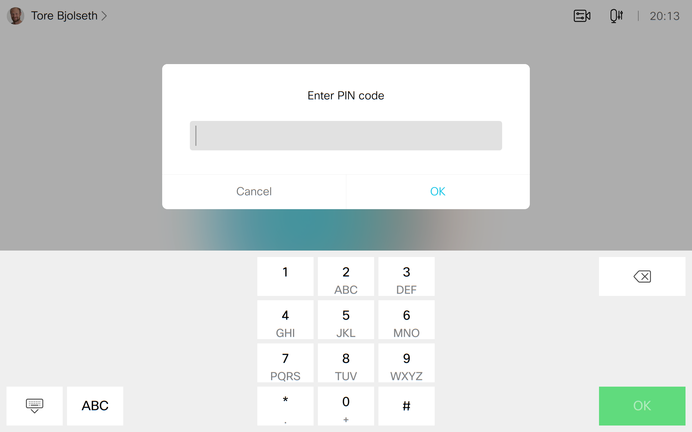

# Pin Code Lock
Protect your video device with a pin code lock that appears as soon as your system goes out of standby.

## Description

**NOTE: This is not a reliable security mechanism**

It can typically be used a lock to prevent children from starting calls, or to hide your meeting agendas.

If you happen to start the macro before having set your pin code, the default pin code is *1234*.

Make sure that standby has not been disabled on your system, otherwise the pin prompt will never appear (except after reboot).

## Requirements

* CE 9.1 or greater
* Supported on both touch controller and devices with touch screen, such as Desk Pro and the Webex Board

## Usage

* Install the macro
* Set your own pin code in the macro code
* Activate the macro
* Set your device in standby, wake it up and enter your pin code

## Recovery

If you forget your pin code, you can recover by disabling the macro from the macro editor or Control Hub.
