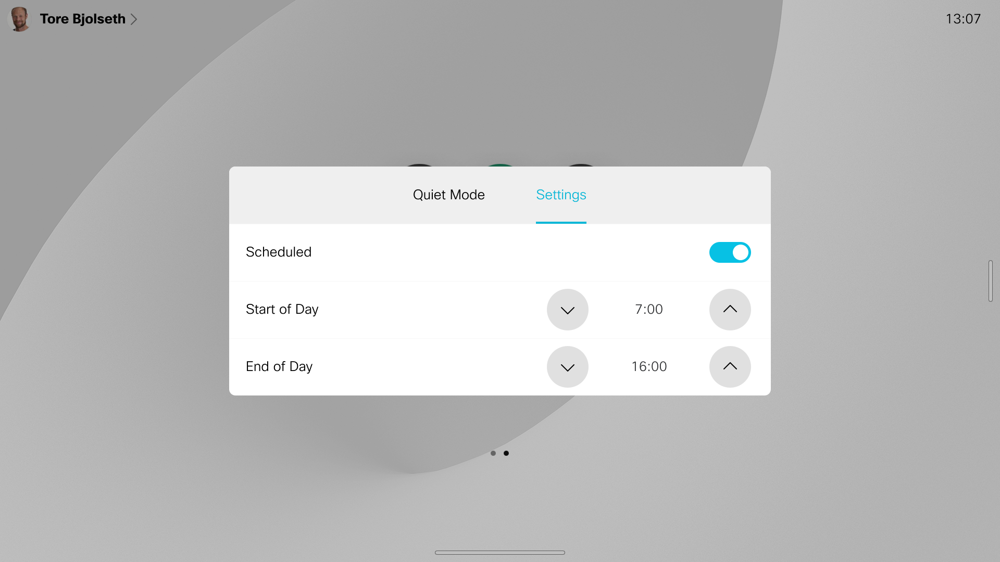

# Quiet Mode
Automatically (or manually) enable quiet mode after work hours, typically in your home office.

## Description

Tired of your device waking up and glowing at home after work hours, or people calling when you are trying to relax? Quiet mode automatically changes your device after work hours by:

* Set do not disturb, so you dont get incoming calls
*	Turn off ultrasound, so your phone or laptop doesn't connect and wake up the device
*	Turn off wake-on-motion, so the device doesn't wake up when you are close
*	Turn off sound effects
*	Set a custom calm wallpaper

The mode can also be toggled manually by a button on the home screen, if you need to work late etc.

## Updates

30. Nov 2021:

* Added support for photo frame in half wake mode
* Add settings for photo frame, and button to activate half wake

13. Nov 2021:

* Device was waking up in weekends, fixed

12. Nov 2021:

* Possible to set time for start/end of day on device itself
* Possible to turn on/off scheduled quiet mode on device itself
* Your custom wallpaper is not removed if you do not choose any wallpaper
* Self view is hidden when in quiet mode

## Requirements

* CE 9.1 or greater
* Supported on both touch controller and devices with touch screen, such as Desk Pro and the Webex Board

## Note

This macro uses the `xConfig FacilityService` to store the user's preferences, so you should not install it if you are using facility service actively on your device.
