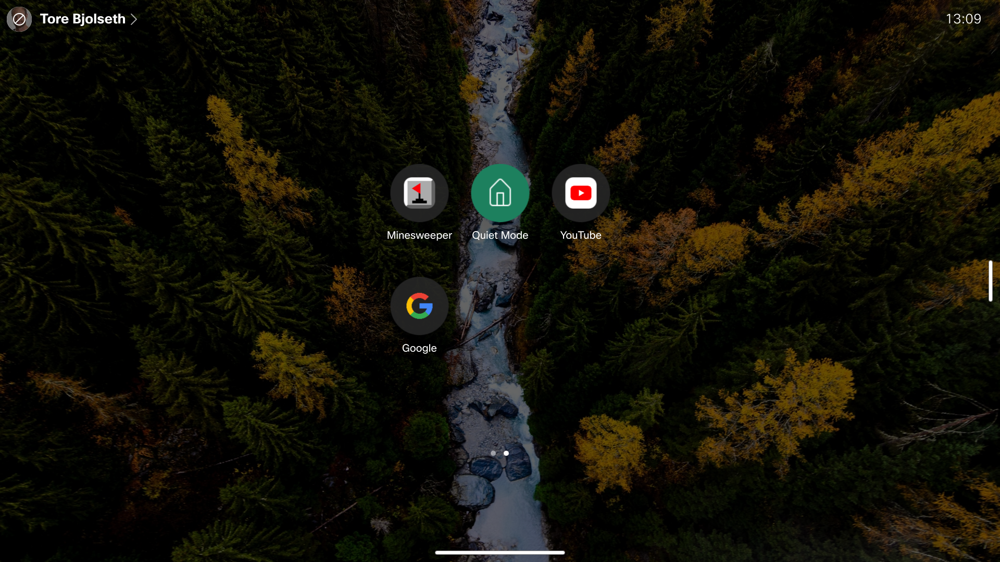

# Quiet Mode
Automatically (or manually) enable quiet mode after work hours, typically in your home office.

## Description

## Requirements

* CE 9.1 or greater
* Supported on both Touch 10 and devices with touch screen, such as Desk Pro and the Webex Board

## Usage

## Recovery

