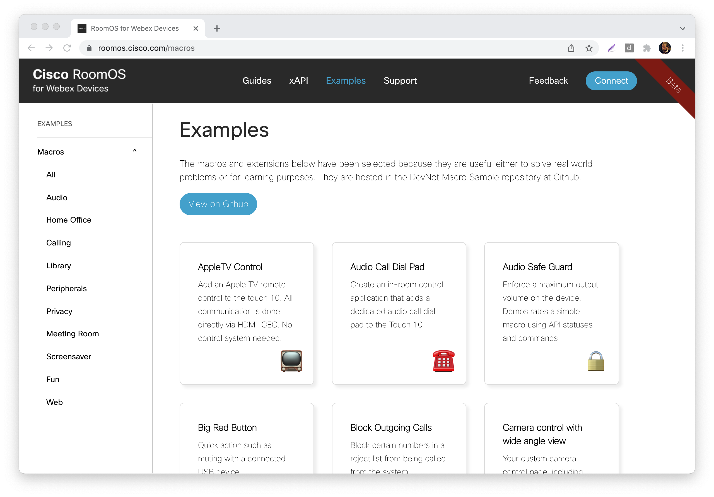

# Cisco CE Room Devices - Macros

Macros allow you to customise your video devices and these are especially powerful in combination with the User Interface (UI) Extensions.

The macros can also be browsed and saved easily from [roomos.cisco.com](https://roomos.cisco.com/macros).

If you connect your video device to this website, you can install the macros and UI extensions directly. Then, it's simple to make adjustments and create your own tools.

Here is selection of macros:

| Macro        | Description           |
| :------------------------ |:-------------|
| AppleTV Control      | Add an Apple TV remote control to the touch controller. All communication is done directly via HDMI-CEC and no control system needed.      |
| Audio Call Dial Pad | Add a dedicated audio call dial pad to the touch controller. |
| Audio Safe Guard      | Enforce a maximum output volume on the device.     |
| Block Outgoing Calls | Block certain numbers from being called from the system. |
| Big Red Button | Perform a quick action with a third party device. For example, mute and unmute yourself by pressing a button on a connected USB device. |
| Camera control with wide angle view      | Create a custom camera control page providing a wide angle view of two cameras and the ability to control multiple cameras simultaneously.      |
| Conditional Autoanswer with Prompt      | Auto answer on incoming calls for a select number of remote sites.      |
| Join 3rd Party Meeting | Join a third party non-Webex meeting (e.g., Microsoft Teams or Zoom) through a custom Join Meeting panel. |
| Join Zoom with DTMF Zoom Tools | Join a Zoom call easily from a Webex Device. |
| Language Selector      | Change the language on the user interface through a custom panel. |
| Multi-Content Solution | Compose multiple video inputs into one presentation source and send it to the far-end. |
| Pin Code Lock | Require a user to enter a PIN code when using the video system. |
| Remote Monitoring Alert | Display OSD\Touch warning text when video snapshots (aka remote monitoring) are being captured. |
| Room Capacity Alert | Display an alert on the device if a set capacity is exceeded. This is based on the people count API. |
| Room Cleaning and Usage | Record cleaning events, shows time since last used, time since last cleaned, and number of times since last cleaned. Warn of capacity restrictions. |
| Room Kit Pro SX80 GPIO | Perform actions when triggering a change on the built-in GPIO. Add a one-button-to-dial button on the wall. |
| Scheduled Actions | Automatically perform actions at a specified time and day (e.g., place a call at 12:00). |
| Smart Dual Screen Presentation | Allow the primary monitor on multiscreen systems to display presentation content when not in a video call. |
| Speed Dials Panel | Provide speed dial buttons making commonly used numbers easily accessible. For example, maybe you want to add calling 911 or the Pizza Place more prominent?     |
| TicTacToe      | Add a fun game which allows the user to see how to update images and panels in real-time and in relation to user input.    |
| WebApps Manager  | Manage ad-hoc local web apps on a device by providing a UI to add new web apps and remove existing ones. |
| Library - Send Webex Message | Send a Webex (chat) message from the video device using the Webex APIs. |
| Library - Weather Forecast | Get the global weather forecast from the free Norwegian weather service. |

## Requirements
1. Webex devices running Software version CE9.2.1 or newer (e.g., Webex Board, Desk, or Room Series).
2. Some macros using newer features require newer firmware. See the requirements list specified within each macro.
3. Admin user access to endpoint.

## Getting Started
1. Read about macros and explore the examples from [Cisco RoomOS for Webex Devices](https://roomos.cisco.com).
2. See the latest version of the [Cisco Webex Board, Desk, and Room Series Customization Guide](https://www.cisco.com/c/en/us/support/collaboration-endpoints/spark-room-kit-series/products-installation-and-configuration-guides-list.html)
for a comprehensive introduction of UI extensions and macros; as well as step-by-step instructions on how to build and upload your code.
3. Watch this video for a quick introduction of what In-Room Controls are: https://youtu.be/IQ2Z104Xf50

## Additional Information
##### XAPI
Documentation for the xAPI can be found in the [Command References overview](https://www.cisco.com/c/en/us/support/collaboration-endpoints/telepresence-quick-set-series/products-command-reference-list.html).

## Disclaimer
This example is only a sample and is **NOT guaranteed to be bug free and production quality**.

The sample macros are meant to:
- Illustrate how to use the Webex Macros.
- Serve as an example of the step-by-step process of building a macro using JavaScript and integration with the Codec xAPI.
- Provided as a guide for a developer to see how to initialize a macro and set up handlers for user and dialog updates.

The sample macros are made available to Cisco partners and customers as a convenience to help minimize the cost of Cisco Finesse customizations. Cisco does not permit the use of this library in customer deployments that do not include Cisco Video Endpoint Hardware.

## Support Notice
[Support](http://developer.cisco.com/site/devnet/support) for the macros is provided on a "best effort" basis via DevNet. Like any custom deployment, it is the responsibility of the partner and/or customer to ensure that the customization works correctly and this includes ensuring that the macro is properly integrated into 3rd party applications.

It is Cisco's intention to ensure macro compatibility across versions as much as possible and Cisco will make every effort to clearly document any differences in the xAPI across versions in the event that a backwards compatibility impacting change is made.

Cisco Systems, Inc. 
[http://www.cisco.com](http://www.cisco.com) 
[http://developer.cisco.com/site/roomdevices](http://developer.cisco.com/site/roomdevices)
