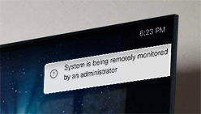
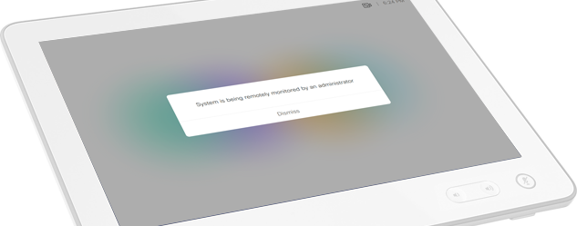

# Remote Monitoring Alert
Provides on-screen alerts to OSD and Touch display when remote monitoring via the admin UI is taking place.  Script fires alert whenever a new `VideoSnapshotTaken` event is seen, and watches for further events typically seen when continuous refresh is toggled in the UI.  Interval constant may need to be adjusted based on codec model and desired behavior.

*contributed by [Fred Nielsen](https://github.com/fredless) @ [ePlus Technology](https://www.eplus.com)*

*diagram editable via draw.io*

Not extensively tested across a broad selection of code or systems, further contributions and issues welcome.

