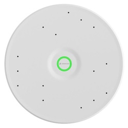

# Sennheiser

Ensures that the Sennheiser TCCM Ceiling Mic is synced with the mute state of the Cisco video device.

If for any reason the video device is not able to update the Sennheiser mute state, it displays a warning to users on the screen.

## Installation

The integration consists of a simple library module containing the HTTP API calls necessary to talk to the ceiling mic, and a macro for calling those APIs whenever the video system mute state changes.

* Install `sennheiser-lib.js` and `sennheiser-sync.js` on the video device
* Enter the IP address, the api username and password in the `sennheiser-sync.js` file
* Enable the `sennheiser-sync.js` macro

Try muting / unmuting the mic (in call) - the LED on the ceiling mic should always stay in sync.

## Pre-requisites

- A working setup with a Cisco video device and a Sennheiser ceiling mic