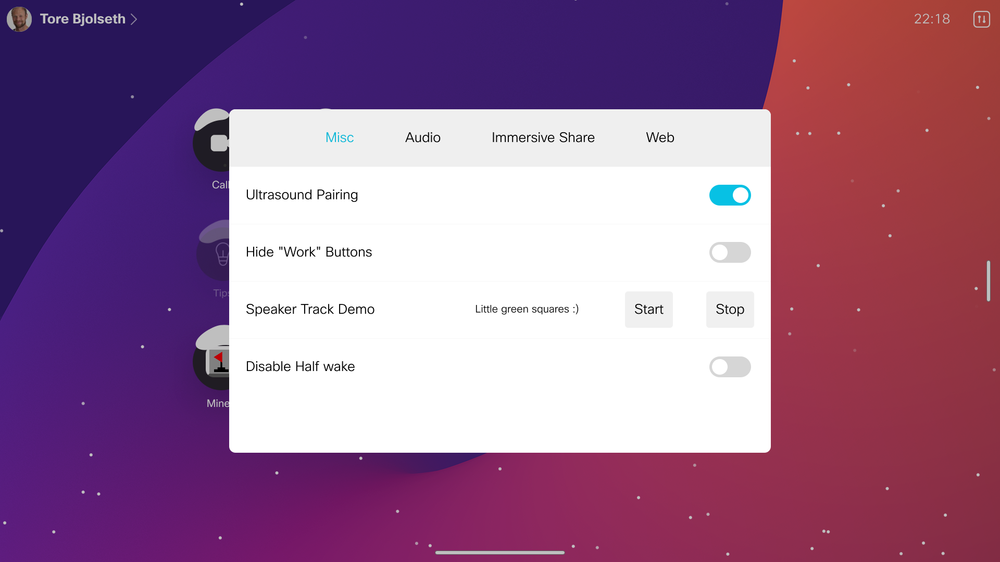
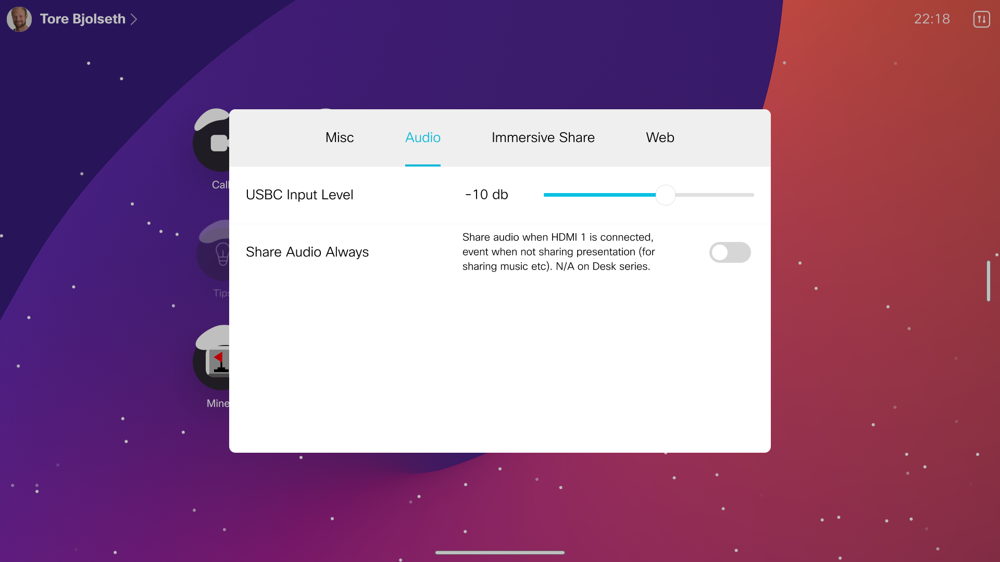
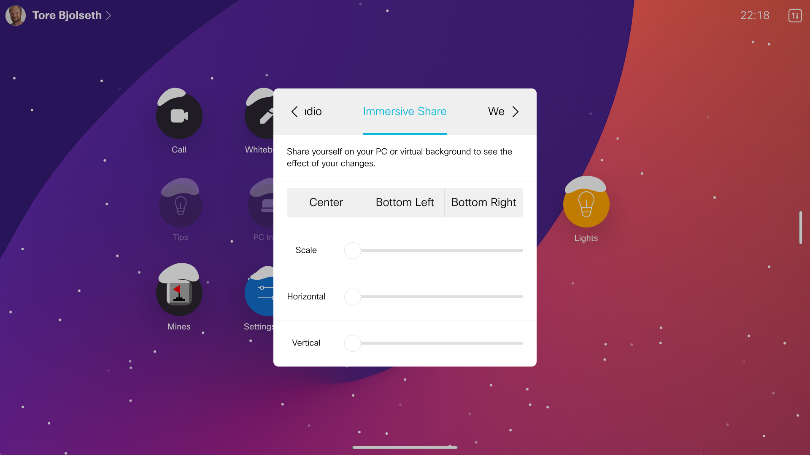
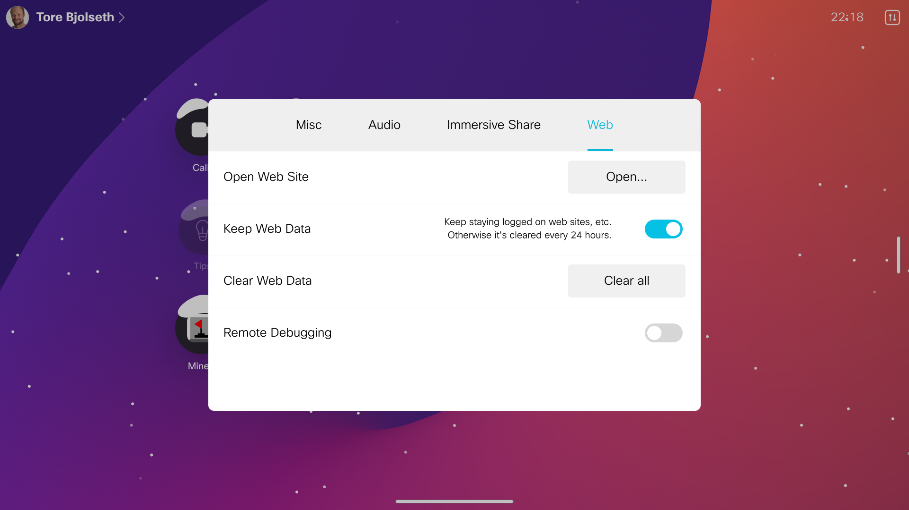

# Settings Pro

Settings that you may want but don't find in the default user interface.

## Settings: Misc

* Turn off ultrasound pairing if you have multiple devices in the room and they interfer with each other
* Hide work buttons (call, share etc) when device is used outside work
* Speaker track demo - show how the camera is tracking your face
* Disable half wake - if you are tired of the device switching btw home screen and half wake

## Settings: Audio

* Tune up the max volume for your PC input volume, for parties or demos
* Share audio in call with your friends, without sharing presentation on screen (Not available on Desk series)

## Settings: Immersive share

* Fine tune the exact size and position of your immersive presenter when overlaid on top of your laptop screen

## Settings: Web

* Open any URL that you'd like without adding it as a web app, or Google a word
* Prevent web data from being deleted daily (stay logged in to Gmail etc)
* Clear web data if you want a fresh start
* Easily turn on/off web debugging (for web developers)