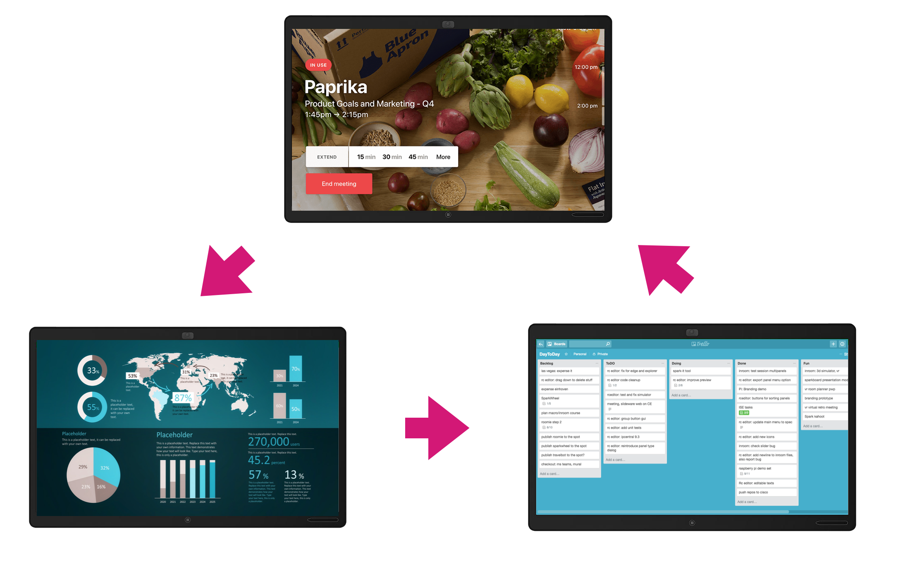

# Signage Carousel

Change the digital signage URL on your device periodically.

**Author: Tore Bjolseth**

## Description

Instead of showing a fixed page as signage, swap between several different ones with a fixed time interval.

Note: Works best with passive signage. If the signage is interactive, you might risk that the signage switches while you are in the middle of something.

TIP: Use the [Office Hours settings](https://roomos.cisco.com/xapi/search?search=officehour) to run signage only during the times that people are in the office. Running signage 24/7 can reduce the life time of certain screens.

## Requirements

* CE 9.1 or greater
* Web engine enabled

## Usage

* Install the macro
* Edit the macros and add the URLs you want to show
