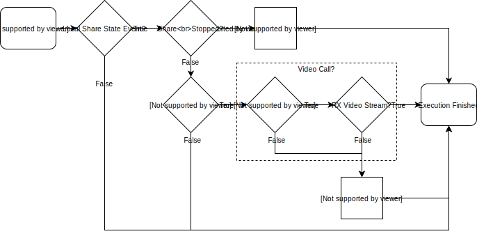

# Smart(er) Dual-Screen Presentation

*contributed by [Fred Nielsen](https://github.com/fredless) @ [ePlus Technology](https://www.eplus.com)*

Macro targeting multiple\dual screen systems intended to reconfigure the primary video output in certain situations when a local presentation source is shared.  If the codec is NOT receiving a remote video stream on the main channel when this happens, it will reconfigure the primary monitor role to allow presentation content to also show up there.  This is oft sought after functionality, particularly for systems that are most often used in lecture or training formats.

*diagram editable via draw.io*

Not extensively tested across a broad selection of code or systems, further contributions and issues welcome.