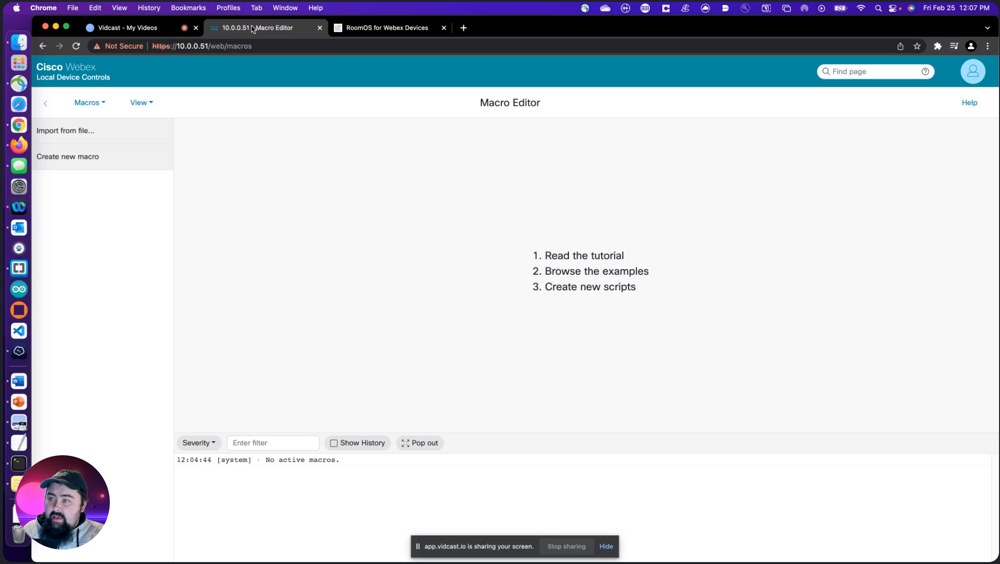

# USB Mode Version 2 🎉

## NEWS
- [Call from Laptop](https://help.webex.com/en-us/article/ney3qxe/Call-from-laptop-using-the-Webex-device-as-a-web-camera#Cisco_Reference.dita_d3c1dbe8-4263-4d55-b19f-6a49478be4c5) is now available on RoomOs 11
  - Call from Laptop is a native implementation of the USB Macro. If you're on RoomOs 11, we encourage you switch from the USB Mode Macro to the Call from Laptop feature
- USB Mode Version 3 Beta Ending Soon
  - A new version of the USB Macro will be made available in the comming months. Call from Laptop is still recommended over the Macro, but for those who prefer a macro, new features and more stability coming soon

## Table of Contents
_⬆️ => Click this arrow to bring you back to the Table of Contents_
- [About](#about)
- [Before You Begin](#before-you-begin)
- [How does the script work](#how-does-the-script-work)
- [Requirements](#requirements)
- [How to get started](#how-to-get-started)
- [Macro Installation](#macro-installation)
- [Useful Links](#useful-links)
- [Authors and Acknowledgments](#authors)
- [FAQ](#faq)
- [USB Mode Room Device Compatibility Matrix](#usb-mode-room-device-compatibility-matrix)

## About
[⬆️](#table-of-contents)

The USB Mode macro is a community driven solution that enables USB Passthrough for Cisco Room devices that do not natively support this feature.

USB Passthrough is a feature, found on products like the Webex Room Kit Mini and the Webex Desk Pro, that allows you to take advantage the device's rich microphone(s), intelligent camera(s) and powerful speaker(s) as a sophisticated webcamera for various 3rd party software clients.

To better illustrate how this macro works, please click on the video demo below to see USB mode in action

### Script Info
Version: 2-2-10 
Last Updated: February 22, 2022

## Before you begin
[⬆️](#table-of-contents)

USB Mode is only 1 flavor of the USB Passthrough solution. Many new Room Devices support this natively and we recommend you work with the native tools built into the product if available.

Check out the [USB Mode Room Device Compatibility Matrix](#usb-mode-room-device-compatibility-matrix) below to see which USB solution is right for you.

**IMPORTANT**: If you're upgrading from USB Mode Version 1.X, please follow these steps before installing version 2
- Take a backup of your endpoint
- Disable USB Mode Version 1.X on your touch panel if enabled
- Delete all USB Mode Version 1.X Macros from the Macro Editor
  - projUSB_Main_1-X-X
  - projUSB_FirstTimeSetup_1-X-X
  - memStoreV2
- Delete the USB Mode Version 1.X UI Elements in the UI Extensions Editor
  - Enable USB Mode Panel
  - Disable USB Mode Panel
- **Review and confirm your devices default configuration for a normal non-USB use**
- Continue with installing USB Mode Version 2

## How does the script work
[⬆️](#table-of-contents)

While USB mode is enabled, your Room Device's base configuration is stored in memory and then reconfigured to send Microphone Data out the Line Output of your device and your Main Source video out the last video output connection(Model Dependent); these feeds are fed into a compatible USB capture card(See docs for details). 

The room devices native UI elements, such as calling, sharing, meetings etc, are hidden, your presentation is started and the device is placed into an infinite Do Not Disturb(DND) Loop.

These elements are hidden and DND is enabled to prevent calling out or in while USB mode is enabled in order to prevent confusing the user as to what the system is doing.

When USB mode is Disabled, your system will show all Native UI Elements, disengage infinite DND and recover your system's base configuration for full Webex and SIP use.

## Requirements
[⬆️](#table-of-contents)

- A copy of the [Deployment Guide](https://github.com/CiscoDevNet/roomdevices-macros-samples/raw/master/USB%20Mode%20Version%202/USB%20Mode%20V2%20Guides.zip)
- A [compatible Room Device](#usb-mode-endpoint-compatibility-matrix) either on
  - Latest stable software channel
  - Non-deferred software release
  - Minimum RoomDevice Software needed **ce9.14.3**
- Administrator privileges to your Room Device
- Ability to navigate the Macro Editor
- Ability to Navigate the UI Extensions Editor
- Compatible USB Capture Device
  - Review [Deployment Guide](https://github.com/CiscoDevNet/roomdevices-macros-samples/raw/master/USB%20Mode%20Version%202/USB%20Mode%20V2%20Guides.zip) for recommendations
- Knowledgeable on AV design and Implementation

## How to get started
[⬆️](#table-of-contents)

- Download a copy of the **Deployment Guide**, which contains all the files you need, and follow the instructions in the guide

## Macro Installation
[⬆️](#table-of-contents)

- Access the web interface of your endpoint directly, and use the macro editor to Import the Javascript file
- Use the [RoomOs](https://roomos.cisco.com/macros) website to connect to your device and install the script with installer tool
- For bulk deployment, Ce-Deploy has you covered
  - [Ce-Deploy Community Space](https://eurl.io/#SJWfk6qUV)
  - [Ce-Deploy Builds](https://github.com/voipnorm/CE-Deploy/releases/)

## Useful Links
[⬆️](#table-of-contents)

### Join the Community!
The [PROJECT: USB Mode](https://eurl.io/#L6Rcn39Rn) space on Webex is filled with over 1500 partners, integrators, customers and USB enthusiasts; all sharing their experience, creativity and use cases around USB Mode. Definitely a great place to ask questions.

### Blog Posts
  - [Innovations from Webex Experts](https://blog.webex.com/webex-devices/innovations-from-webex-experts-making-devices-even-better/)
  - [USB Passthrough Mode on Video Endpoints](https://gblogs.cisco.com/ch-tech/usb-passthrough-mode-on-video-endpoints/)
  - [Unlocking BYOM in a Webex Environment](https://community.cisco.com/t5/announcements/walkthrough-wednesday-unlocking-byom-in-a-webex-environment/m-p/4549307#M850)

### Videos

| USB- Passthrough with Cisco Video Devices | Turn Cisco Video Endpoint into USB Camera |
| ------------------ | ---------- |
|  |  |
|USB Mode 2 - Configuration||
|||

### Multi-Device Solutions
  - [Lightware Camera Share Bundle](https://lightware.com/cisco/camera-share)
    - [Lightware Bundles Product IDs](https://community.cisco.com/t5/webex-user-documents/lightware/ta-p/4484725)

## Author(s)
[⬆️](#table-of-contents)

|                  | **Enrico Conedera**                 | **John Yost**                | **Robert(Bobby) McGonigle**  |
|------------------|-------------------------------------|------------------------------|------------------------------|
| **Contribution** | Project Lead                        | Consulting Engineer          | Macro Author                 |
| **Title**        | Senior Technical Marketing Engineer | Technical Marketing Engineer | Technical Marketing Engineer |
| **Org**          | Cisco Systems                       | Cisco Systems                | Cisco Systems                |
| **Contact**      | econeder@cisco.com                  | johyost@cisco.com            | bomcgoni@cisco.com           |

## Acknowledgments
- Zacharie Gignac from Université Laval in Canada
  - His contributions to the memory storage functionality are invaluable
- All of our community members in the Project USB space on Webex
  - You're all awesome, thank you for your ideas, patience and testing 😃

## FAQ
[⬆️](#table-of-contents)

### Will Cisco TAC give me assistance?
- TAC does not support Macros, thus the USB mode macro won't be supported. Any hardware and software support you have with Cisco will still be covered, but they may require you to disable USB Mode while you troubleshoot with them.
### Why is Selfview full screen on one of my displays?
- If you use a dual screen Room Kit or Plus, you will see that your second screen shows fullscreen SelfView. (This does hot happen if you use a single screen system).
- USB Mode relies on your Selfview feed being sent to the USB Capture Device, so this is normal.
- If you are using a Room Kit Pro, Room 70 G2, SX80, or MX700/800, you can use one or two screens without seeing Selfview.  If you happen to use three screens, then you will see Selfview on the third screen.display while USB mode is in use
### Where can I get assistance?
- USB mode is a community driven solution. We recommend you read the all the documentation in the [Deployment Guide](https://github.com/CiscoDevNet/roomdevices-macros-samples/raw/master/USB%20Mode%20Version%202/USB%20Mode%20V2%20Guides.zip).
- If you still need more assistance, join the [PROJECT: USB Mode](https://eurl.io/#L6Rcn39Rn) space on Webex
### Can I hide Selfview on the second display?
- In a complex audiovisual installation that uses a video matrix switcher, it is feasible to have the second screen show something else. Ask your Audio Visual integrator on possible solutions.
### How can I see my selfview on screen?
- If you're running a single screen deployment of USB Mode, then the native Selfview is only being sent to your USB capture device and won't be visible while USB mode is enabled
- We recommend you use the Selfview feature built into the software client you're currently using. Most, if not all, software based clients have a way to preview your camera feed
### USB Mode stops working and I get an error message?
- When USB mode detects no Video Input signal from a computer, it's designed to disengage USB mode. An active presentation is required for USB mode to work, so be sure to share your screen before activating USB mode
### Why do I see my presentation source as my USB camera feed?
- Enable USB Mode must be pressed for the camera view to become available
- If you still don't see your camera, disable USB mode and restart your Room Device
### Why did my Camera View on my software client dissapear?
- If you chose to hide selfview or exit selfview fullscreen under the camera control menu, then you've made a change to what the USB capture device is receiving
- Undo the changes you made, or disable then re-enable USB Mode to fix this
### Why can't people on my call hear my Audio?
- USB Mode requires an audio connection be made to the USB Capture card
- Check the wiring guide in the deployment guide
- Keep in mind, not all USB capture cards are the same, some may require a special attenuation cable for audio to function properly
### Can I have USB Mode Version 1 and Version 2 running on the same device?
- No and not recommended either
- We Encourage you switch to Version 2 when you can
### How can I hide other customization when USB Mode is active?
- USB Mode Version 2 has a configuration sections where you can hide other customizations when USB Mode is Enabled
- You can even show customization you built for USB Mode specifically
- Review the Release notes in the [Deployment Guide](https://github.com/CiscoDevNet/roomdevices-macros-samples/raw/master/USB%20Mode%20Version%202/USB%20Mode%20V2%20Guides.zip) to learn how

## USB Mode Room Device Compatibility Matrix
[⬆️](#table-of-contents)

### Key
- Native USB: Devices that have USB Passthrough built into their hardware. No need for a macro and highly recommended 😃
- Native Inogeni: Native OS support for USB mode, no macro required. Inogeni 4KX-PLUS Capture device required (future software release)
- Macro 1-3: Original USB Mode Macro, accessible in the USB Mode community space. Recommend upgrading to USB Mode Version 2 when possible.
- Macro 2-2-10: USB Mode Version 2

| Room Device        | Native USB | Macro 1-3 | Macro    2-2-10 | [Native USB Inogeni OS 11](https://help.webex.com/en-us/article/ney3qxe/Call-from-laptop-using-the-Webex-device-as-a-web-camera#Cisco_Reference.dita_d3c1dbe8-4263-4d55-b19f-6a49478be4c5)  |
| ------------------ | ---------- | --------- | --------------- | ------------------- |
| C-Series and older | 🟥 **No**     | 🟥 **No**    | 🟥 **No**          | 🟥 **No**              |
| Mx200/300 G1       | 🟥 **No**     | 🟥 **No**    | 🟥 **No**          | 🟥 **No**              |
| Mx200/300 G2       | 🟥 **No**     | 🟥  **No\***  | 🟥 **No**          | 🟥 **No**              |
| Dx70/Dx80          | 🟥 **No**     | 🟥 **No**    | 🟥 **No**          | 🟥 **No**              |
| Sx10               | 🟥 **No**     | 🟥 **No**    | 🟥 **No**          | 🟥 **No**              |
| Sx20               | 🟥 **No**     | 🟥  **No\***  | 🟥 **No**          | 🟥 **No**              |
| Sx80               | 🟥 **No**     | 🟩 **Yes**   | 🟩 **Yes**         | 🟥 **No**              |
| Mx700/700ST        | 🟥 **No**     | 🟩 **Yes**   | 🟩 **Yes**         | 🟥 **No**              |
| Mx800/800ST/800D   | 🟥 **No**     | 🟩 **Yes**   | 🟩 **Yes**         | 🟥 **No**              |
| Board 55/55s       | 🟥 **No**     | 🟥 **No**    | 🟥 **No**          | 🟥 **No**              |
| Board 70/70s       | 🟥 **No**     | 🟥 **No**    | 🟥 **No**          | 🟥 **No**              |
| Board 85s          | 🟥 **No**     | 🟥 **No**    | 🟥 **No**          | 🟥 **No**              |
| Room USB           | 🟩 **Yes**    | 🟥 **No**    | 🟥 **No**          | 🟥 **No**              |
| Room Kit Mini      | 🟩 **Yes**    | 🟥 **No**    | 🟥 **No**          | 🟥 **No**              |
| Room Bar           | 🟩 **Yes**    | 🟥 **No**    | 🟥 **No**          | 🟥 **No**              |
| Room Kit           | 🟥 **No**     | 🟩 **Yes**   | 🟩 **Yes**         | 🟩 **Yes** OS11 |
| CODEC Plus         | 🟥 **No**     | 🟩 **Yes**   | 🟩 **Yes**         | 🟩 **Yes**  OS11 |
| Room EQ           | 🟩 **Yes**    | 🟥 **No**    | 🟥 **No**          | 🟥 **No**              |
| CODEC Pro          | 🟥 **No**     | 🟩 **Yes**   | 🟩 **Yes**         | 🟩 **Yes** OS11  |
| Room 55        | 🟥 **No**     | 🟩 **Yes**   | 🟩 **Yes**         | 🟩 **Yes** OS11 |
| Room 55D        | 🟥 **No**     | 🟩 **Yes**   | 🟩 **Yes**         | 🟥 **No**  |
| Room 70S       | 🟥 **No**     | 🟩 **Yes**   | 🟩 **Yes**         | 🟩 **Yes**  OS11 |
| Room 70D       | 🟥 **No**     | 🟩 **Yes**   | 🟩 **Yes**         | 🟥 **No**  |
| Room 70S G2    | 🟥 **No**     | 🟩 **Yes**   | 🟩 **Yes**         | 🟩 **Yes** OS11 |
| Room 70D G2    | 🟥 **No**     | 🟩 **Yes**   | 🟩 **Yes**         | 🟥 **No**  |
| Room 70 Panorama   | 🟥 **No**     | 🟥 **No**    | 🟨 **FR (3.X)**    | 🟥 **No**  |
| Room Panorama      | 🟥 **No**     | 🟥 **No**    | 🟨 **FR (3.X)**    | 🟥 **No**  |
| Desk Mini          | 🟩 **Yes**    | 🟥 **No**    | 🟥 **No**          | 🟥 **No**              |
| Desk               | 🟩 **Yes**    | 🟥 **No**    | 🟥 **No**          | 🟥 **No**              |
| Desk Hub           | 🟩 **Yes**    | 🟥 **No**    | 🟥 **No**          | 🟥 **No**              |
| Desk Pro           | 🟩 **Yes**    | 🟥 **No**    | 🟥 **No**          | 🟥 **No**              |
| Board Pro 55       | 🟩 **Yes**    | 🟥 **No**    | 🟥 **No**          | 🟥 **No**              |
| Board Pro 75       | 🟩 **Yes**    | 🟥 **No**    | 🟥 **No**          | 🟥 **No**              |

\* => USB mode script will function, but this endpoint requires a 3rd party audio solution to be fed into the USB Capture Device 
❖ => Support for this is in review for RoS 11 
FR (3.X) => Available in Future Release of Macro 3.X 
OS11 => Requires RoomOs 11 
[⬆️](#table-of-contents)
