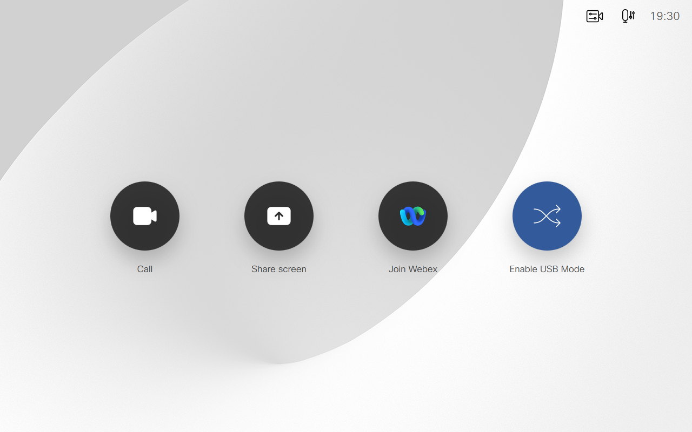

# USB Mode Version 2 🎉

## About

The USB Mode macro is a community driven solution that enables USB Passthrough for Cisco Room devices that do not nativley support this feature.

USB Passthrough is a feature, found on products like the Webex Room Kit Mini and the Webex Desk Pro, that allows you to take advantage the device's rich microphone(s), intelligent camera(s) and powerful speaker(s) as a sophisticated webcamera for various 3rd party software clients.

To better illustrate how this macro works, please click on the video demo below to see USB mode in action

## Before you begin
USB Mode is only 1 flavor of the USB Passthrough solution. Many new Room Devices support this nativley and we recommend you work with the native tools built into the product if available.

Check out the [USB Mode Endpoint Compatibility Matrix](#usb-mode-endpoint-compatibility-matrix) below to see which USB solution is right for you.

## Requirements
- A copy of the full deployment guide
- Compaitble Room Device either on
  - Latest stable software channel
  - Non-defered software release
- Admin Priveldges to your Room Device
- Ability to navigate the Macro Editor
- Compatible USB Capture Device

## How does the script work
USB Mode modify's your Room Devices base configuration in order to route your devices Selfview Video Feed and Microphone Audio data to a compatible USB capture card. Your system's base configuration is stored each time USB Mode is enabled in a separate script and is fully restored when disabling USB mode.

While USB mode is enabled, the Room Device is placed in an Infinite Do Not Disturb state, 

## Author(s)
- Project Lead: Enrico Conedera
  - Senior Technical Marketing Engineer
  - econeder@cisco.com
  - Cisco Systems
- Consulting Engineer: John Yost
  - Technical Marketing Engineer
  - johyost@cisco.com
  - Cisco Systems
- Macro Author: Robert(Bobby) McGonigle Jr
  - Technical Marketing Engineer
  - bomcgoni@cisco.com
  - Cisco Systems

## Acknowledgments
- Zacharie Gignac from Université Laval in Canada
  - His contributions to the memory storage functionality are invaluable
- All of our community members in the Project USB space on Webex
  - You're all awesome, thank you for your ideas, patience and testing 😃

## USB Mode Endpoint Compatibility Matrix

| CODEC              | Native USB | Macro 1-3 | Macro    2-2-10 | Native USB Inogeni  |
| ------------------ | ---------- | --------- | --------------- | ------------------- |
| C-Series and older | **No**     | **No**    | **No**          | **No**              |
| Mx200/300 G1       | **No**     | **No**    | **No**          | **No**              |
| Mx200/300 G2       | **No**     | **No\***  | **No**          | **No**              |
| Dx70/Dx80          | **No**     | **No**    | **No**          | **No**              |
| Sx10               | **No**     | **No**    | **No**          | **No**              |
| Sx20               | **No**     | **No\***  | **No**          | **No**              |
| Sx80               | **No**     | **Yes**   | **Yes**         | **No**              |
| Mx700/700ST        | **No**     | **Yes**   | **Yes**         | **No**              |
| Mx800/800ST/800D   | **No**     | **Yes**   | **Yes**         | **No**              |
| Board 55/55s       | **No**     | **No**    | **No**          | **No**              |
| Board 70/70s       | **No**     | **No**    | **No**          | **No**              |
| Board 85s          | **No**     | **No**    | **No**          | **No**              |
| Room USB           | **Yes**    | **No**    | **No**          | **No**              |
| Room Kit Mini      | **Yes**    | **No**    | **No**          | **No**              |
| Room Kit           | **No**     | **Yes**   | **Yes**         | **FR (Room OS 11)** |
| CODEC Plus         | **No**     | **Yes**   | **Yes**         | **FR (Room OS 11)** |
| CODEC Pro          | **No**     | **Yes**   | **Yes**         | **FR (Room OS 11)** |
| Room 55/55D        | **No**     | **Yes**   | **Yes**         | **FR (Room OS 11)** |
| Room 70D/70S       | **No**     | **Yes**   | **Yes**         | **FR (Room OS 11)** |
| Room 70D/70S G2    | **No**     | **Yes**   | **Yes**         | **FR (Room OS 11)** |
| Room 70 Panorama   | **No**     | **No**    | **FR (2-3-0)**  | **FR (Room OS 11)** |
| Room Panorama      | **No**     | **No**    | **FR (2-3-0)**  | **FR (Room OS 11)** |
| Desk Mini          | **Yes**    | **No**    | **No**          | **No**              |
| Desk               | **Yes**    | **No**    | **No**          | **No**              |
| Desk Hub           | **Yes**    | **No**    | **No**          | **No**              |
| Desk Pro           | **Yes**    | **No**    | **No**          | **No**              |
| Board Pro 55       | **Yes**    | **No**    | **No**          | **No**              |
| Board Pro 75       | **Yes**    | **No**    | **No**          | **No**              |

\* => USB mode script will function, but this endpoint requires a 3rd party audio solution to be fed into the USB Capture Device 
FR => Future Release, Tentative release version within parenthesis

