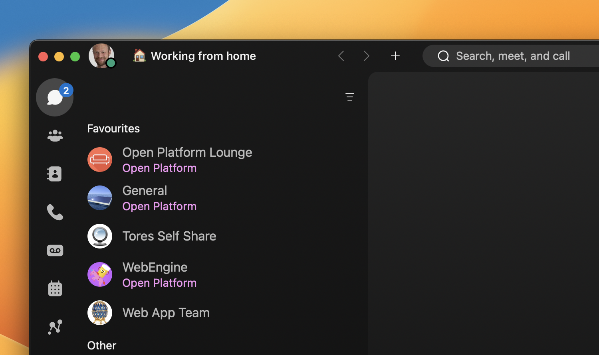

# Working from home

Automatically set your Webex status to where you are working from.

Automatically sets your Webex status when you use a certain device, eg at home or in the office. This means you can easily tell your colleagues whether you are physically at the office or working from home that day.

This is possible since a Cisco device registered to Webex will synchronize the user status.

If you are lucky enough to have a personal device both at the office and at home, you can install the extension on both devices with a different message appropriate for each place.

The status is automatically set if:

* You are actively using the device (it's not in standby or halfwake mode for at least 5 minutes)
* It's being used with the office hours you specify (eg 7:00 - 17:00)
* Your current status is not the same as the one specified by your device

You will be notified by a prompt on the main screen when the extension updates your status, and it will of course appear in the status text in the top left corner too.

If you are in a period without working (eg holidays) but still using the device for non-work use, uninstall the extension or just disable it from the macro editor.

# Requirements

* RoomOS February 2022 software or later
* Webex registered
* Device in personal mode
